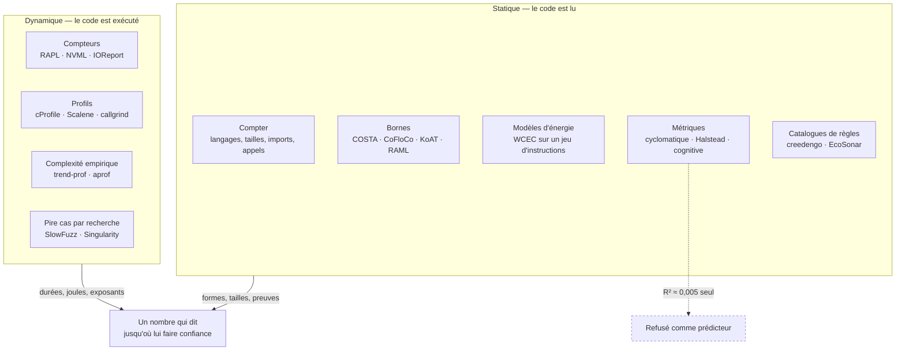

# Lire le code, et le faire tourner

🇫🇷 Français · [🇬🇧 ANALYSIS.md](ANALYSIS.md)

Deux questions sont sous chaque modèle de coût que ce paquet écrit, et elles ne
sont pas symétriques.

**Lire un dépôt peut-il dire ce qu'il coûte à exécuter ?** Presque jamais, et la
littérature est inhabituellement claire sur les raisons.

**L'exécuter peut-il dire comment il passe à l'échelle ?** Oui, sur la plage
effectivement parcourue, et cela vaut plus qu'il n'y paraît.

Cette page est l'enquête derrière ces deux phrases : ce que l'analyse statique
et l'analyse dynamique ont réellement démontré pour la **complexité** et pour la
**consommation**, chiffres et articles à l'appui, et ce qui, de tout cela, a sa
place dans `saggio`. C'est une référence, pas une liste de fonctionnalités. Là
où une technique est refusée, le refus est argumenté plutôt qu'asséné.



## 1. Ce qu'on peut, et ne peut pas, demander à l'analyse statique

### 1.1 Le mur, et où il se trouve

La question générale — *combien de temps ce programme va-t-il tourner, et
combien d'énergie va-t-il tirer* — n'est pas seulement difficile, elle est
indécidable. L'analyse du pire temps d'exécution est équivalente au problème de
l'arrêt dans le cas général : tout outil statique correct calcule donc une
**borne supérieure** plutôt que la réponse, et exige que des bornes de boucles
et des profondeurs de récursion lui soient fournies à la main, sous forme de
*flow facts*, avant de pouvoir calculer quoi que ce soit. C'est la contrainte
fondatrice du domaine, posée dans [la synthèse WCET de Wilhelm et
al.](https://www.cs.fsu.edu/~whalley/papers/tecs07.pdf), et c'est pourquoi les
outils industriels ([aiT](https://www.absint.com/ait/), OTAWA, Heptane) vivent
dans le temps réel embarqué, là où le matériel est assez simple et où les
annotations valent la peine d'être écrites.

Rien, dans un dépôt Python sur un portable équipé d'un GPU, ne relâche cette
contrainte. Tout l'aggrave.

### 1.2 Le travail sérieux : bornes de coût et de complexité

Il existe un corpus réel, profond de plusieurs décennies, qui infère des bornes
symboliques de ressources depuis la source. Il faut savoir précisément ce qu'il
exige.

| Famille | Outils | Ce qu'elle accepte | Ce qu'elle rend |
|---|---|---|---|
| Extraction de récurrences | [COSTA](https://www.researchgate.net/publication/221047639_COSTA_Design_and_Implementation_of_a_Cost_and_Termination_Analyzer_for_Java_Bytecode), SPEED, [CoFloCo](https://arxiv.org/pdf/2202.01769), [KoAT](https://arxiv.org/pdf/2606.28542), Loopus | Bytecode Java, ou C sans pointeurs abaissé en systèmes de transitions entiers | Borne supérieure en forme close sur une mesure de coût |
| Typage amorti | [RaML](https://www.raml.co/publications/) (Resource Aware ML), C4B | Programmes fonctionnels du premier ordre, OCaml | Bornes polynomiales concrètes, *non asymptotiques*, inférées par programmation linéaire |

Les deux familles fonctionnent, et les deux sont étroites par construction. La
famille des récurrences est [explicitement incapable d'inférer des bornes serrées
pour les programmes récursifs non linéaires, amortis, non monotones ou
multiphases](https://arxiv.org/pdf/2202.01769) — même quand une forme close
simple existe. La famille amortie veut un langage fonctionnel typé. Aucune
n'accepte un dépôt dont le coût est dominé par NumPy, un noyau CUDA, une base de
données et un appel réseau.

Le résumé honnête : ces outils répondent sur la *complexité*, sur des classes de
programmes bien plus étroites que celles auditées ici, et ils y répondent sur
une mesure de coût abstraite — pas, jamais, sur des joules.

### 1.3 L'énergie statique : ça existe, et ça ne se transpose pas

L'analyse statique d'**énergie** n'est pas une hypothèse. [Grech, Georgiou,
Pallister, Kerrison et Eder](https://arxiv.org/abs/1405.4565) ont construit des
modèles d'énergie en caractérisant l'énergie de chaque instruction d'un jeu
d'instructions, puis ont porté l'analyse sur la représentation intermédiaire de
LLVM pour relier la structure d'un programme de haut niveau à un modèle
énergétique de bas niveau. La suite étend cela à la [consommation énergétique du
pire cas avec des modèles dépendant des
données](https://dl.acm.org/doi/10.1145/3078659.3078666) et examine [la valeur
et les limites de l'analyse multi-niveaux pour des programmes profondément
embarqués](https://arxiv.org/pdf/1510.07095).

La condition préalable est un modèle énergétique par instruction pour la cible.
Il existe pour un microcontrôleur XMOS. Il n'existe pas, et n'existera pas, pour
un cœur superscalaire dans le désordre avec trois niveaux de cache, un
contrôleur mémoire, un ordonnanceur, un interpréteur à ramasse-miettes et un
accélérateur à l'autre bout d'un lien PCIe.

Ce qui s'en rapproche le plus en haut de la pile est la prédiction statique de
**débit** pour un seul bloc de base :
[uiCA](https://arxiv.org/abs/2107.14210) annonce environ 1 % d'erreur face à la
mesure sur les microarchitectures Intel récentes, aux côtés de `llvm-mca`, d'
[OSACA](https://arxiv.org/pdf/1809.00912), d'IACA et des modèles appris
[Ithemal](https://arxiv.org/abs/1808.07412) et DiffTune. Un bloc de base, en
régime établi, sans entrées-sorties, sans allocateur, sans interpréteur.
D'excellents outils, qui répondent à une question deux ou trois ordres de
grandeur plus petite que « combien coûte cet entraînement ».

### 1.4 Les métriques qui ne sont pas de la complexité

La complexité cyclomatique, le volume de Halstead et la complexité cognitive
sont les métriques qu'un dépôt sait effectivement calculer aujourd'hui :
[`radon`](https://radon.readthedocs.io/) pour McCabe, Halstead et l'indice de
maintenabilité, [`lizard`](https://github.com/terryyin/lizard) pour le nombre
cyclomatique multi-langages, [`complexipy`](https://github.com/rohaquinlop/complexipy)
pour la complexité cognitive façon SonarSource, et la règle `C901` de `ruff`
pour le même compte de McCabe.

Elles mesurent la difficulté à *lire et maintenir* du code. Ce ne sont pas des
mesures du travail effectué, et les preuves sur leur usage comme prédicteurs
d'énergie sont désormais assez précises pour être citées.

[Une étude 2026 portant sur 2 786 méthodes
Java](https://arxiv.org/abs/2607.06124) a extrait 33 traits statiques — lignes
de code, comptes de flot de contrôle, appels internes et externes, complexité
cyclomatique, et quelles API standard chaque méthode touche — puis ajusté onze
modèles de régression sur l'énergie mesurée :

- traits statiques **seuls** : R² ≈ **0,005** ;
- traits statiques **plus le logarithme du temps d'exécution** : R² = **0,46**
  (forêt aléatoire, seuil de variance), MAE 2,02, MAPE 1,75 % ;
- les trois prédicteurs les plus forts selon SHAP, dans l'ordre :
  `log_execution_time`, nombre d'appels internes, complexité cyclomatique.

La conclusion le dit sans détour : *« Static source code metrics alone yield
poor predictive performance, with R² values near zero. »* Les travaux antérieurs
concordent de la manière la moins utile possible — la corrélation entre énergie
et métriques de complexité [va de nulle à forte selon le
corpus](https://arxiv.org/pdf/1701.02344), ce qui est la définition même de ne
pas être un prédicteur.

La complexité cyclomatique est de surcroît [fortement corrélée au nombre de
lignes](https://arxiv.org/pdf/1408.4523) et au volume de Halstead : un modèle
bâti sur plusieurs d'entre elles compte surtout plusieurs fois la même chose. Et
[`radon` comme `lizard` ignorent le sucre syntaxique de
Python](https://www.arothuis.nl/posts/cyclomatic-complexity/) — `3 <= month <= 5`
vaut la moitié de `month >= 3 and month <= 5` — propriété acceptable pour un
score de maintenabilité, rédhibitoire pour un indicateur de coût.

**Verdict pour `saggio` : un nombre de complexité cyclomatique ne doit jamais
apparaître dans un modèle de coût, sous aucun statut.** Il ressemblerait trait
pour trait à un chiffre vérifié tout en portant un R² proche de zéro face à ce
que ce paquet existe pour rapporter.

### 1.5 Les catalogues de règles

[creedengo, ex-ecoCode](https://github.com/green-code-initiative/ecoCode), est
un projet collectif qui publie des analyseurs statiques signalant les structures
de code au coût écologique plausible, empaquetés en règles SonarQube pour Java,
JavaScript, PHP, Python, C#, Android et iOS ;
[EcoSonar](https://github.com/green-code-initiative/EcoSonar) est l'outil
d'audit autour. Le jeu de règles Android s'appuie sur un [catalogue de *code
smells* publié](https://dl.acm.org/doi/fullHtml/10.1145/3551349.3559518).

C'est du travail utile et la direction est la bonne. Deux choses doivent
néanmoins être dites. Les règles encodent des *catalogues de bonnes pratiques*,
pas des écarts mesurés — le dépôt lui-même porte l'avertissement que le projet
en est à un stade très précoce — et un nombre de règles n'est pas une quantité.
« Dix-sept constats d'écoconception » n'est ni des joules, ni des grammes, et ne
se compare pas entre deux dépôts.

Là où une règle est non ambiguë et bon marché, le motif à reprendre est celui
que ce paquet applique déjà aux appels d'API : **citer la ligne, nommer la
pratique, et n'attacher aucun nombre.** Un constat avec un fichier et un numéro
de ligne est une preuve vérifiable. Un constat avec un score est un nombre que
personne ne peut vérifier.

### 1.6 Alors, à quoi sert vraiment l'analyse statique ici ?

Tout ce qui suit est déterministe, vérifiable, et constitue déjà la division du
travail que ce paquet tient — la passe statique possède le comptage, et ne
possède jamais un wattage :

- **Ce qu'est le dépôt** : langages pondérés par extension, archétype, quels
  cadriciels de calcul sont importés, et s'ils le sont par la charge de travail
  ou seulement par la suite de tests.
- **Combien de travail accomplit une exécution complète** : la taille déclarée,
  collectée partout où elle est énoncée, avec une précédence explicite et les
  désaccords consignés plutôt que résolus en silence. C'est ce qui fait d'une
  tranche plafonnée une *fraction* et non une supposition.
- **Quels services payants sont appelés, et à quelle ligne** : une preuve avec
  un fichier et un numéro de ligne, tarifée depuis un catalogue sourcé.
- **Des comptes d'opérations analytiques, là où l'arithmétique est publiée.**
  Pour un transformeur, le calcul total d'entraînement s'approche par
  `FLOPs ≈ c · N · D` sur les paramètres et les jetons, avec `c` [entre 5 et 8,
  6 étant retenu comme base conservatrice](https://arxiv.org/html/2511.17031v2).
  Quand un dépôt déclare son nombre de paramètres et son budget de jetons, c'est
  de l'arithmétique sur deux nombres déclarés et un coefficient sourcé :
  `estimated`, avec sa source, et jamais `measured`.
- **Si le travail est limité par le calcul ou par la mémoire.** Le [modèle
  roofline](https://docs.nersc.gov/tools/performance/roofline/) compare
  l'intensité arithmétique, en FLOP par octet déplacé, au rapport propre de la
  machine entre débit crête et bande passante crête. Ce n'est pas une curiosité :
  `saggio` rapporte déjà un *encadrement* plutôt qu'un nombre lorsqu'il projette
  sur un autre accélérateur, parce que le rapport de calcul et le rapport de
  bande passante diffèrent de plus d'un facteur deux entre un A100 et un H100.

La raison de ce dernier point est physique, et c'est le chiffre le plus utile de
tout ce document. Dans [les mesures de Horowitz en 45
nm](https://gwern.net/doc/cs/hardware/2014-horowitz-2.pdf) à 0,9 V, une
opération flottante coûte **0,4 à 3,7 pJ**, un accès cache **10 à 100 pJ**, et
un accès DRAM hors puce sur 64 bits **1 300 à 2 600 pJ**. Déplacer un mot depuis
la mémoire coûte trois ordres de grandeur de plus que le multiplier. Toute
estimation statique bâtie sur les seuls comptes d'opérations compte la partie
bon marché.

C'est aussi pourquoi les compteurs de FLOP trompent quand on les lit comme un
coût. [`fvcore`](https://github.com/facebookresearch/fvcore/blob/main/docs/flop_count.md),
[`torch.utils.flop_counter`](https://github.com/pytorch/pytorch/blob/main/torch/utils/flop_counter.py)
et le [profileur de FLOPs de
DeepSpeed](https://www.deepspeed.ai/tutorials/flops-profiler/) sont exacts sur
leur périmètre, avec trois réserves à porter : un module personnalisé a besoin
de son propre compteur sinon il compte zéro, DeepSpeed *suppose* que la passe
arrière coûte le double de la passe avant, et la génération jeton par jeton avec
cache KV est généralement hors périmètre. Ajoutez le constat que [le compte de
FLOP est mal corrélé à la latence
GPU](https://dev-discuss.pytorch.org/t/the-ideal-pytorch-flop-counter-with-torch-dispatch/505),
et un total de FLOP se comprend mieux comme une *description du travail* que
comme une prédiction de son coût.

## 2. Ce qu'on peut, et ne peut pas, demander à l'analyse dynamique

### 2.1 Les compteurs, et jusqu'où leur faire confiance

`saggio` lit directement les compteurs d'énergie : les zones powercap/RAPL par
leur nom sous Linux, `IOReport` sur Apple Silicon, NVML via le pilote NVIDIA, et
`amdgpu` / `i915` / `xe` via sysfs. L'étude de référence sur la confiance à
accorder à tout cela est [Jay, Ostapenco, Lefèvre, Trystram, Orgerie et Fichel,
CCGrid
2023](https://perso.ens-lyon.fr/laurent.lefevre/pdf/CCGRID2023_Ostapenco_Jay_Lefevre.pdf),
qui compare neuf wattmètres logiciels — CarbonTracker, CodeCarbon, Energy Scope,
Experiment Impact Tracker, `perf`, PowerAPI, Scaphandre, Green Algorithms et ML
CO2 Impact — à des wattmètres physiques de haute précision sur Grid'5000.

Ce qu'ils trouvent, par ordre d'importance :

- **La forme est juste.** La corrélation de Pearson avec le wattmètre mural va
  de **0,93 à 0,956** selon l'outil. Un wattmètre logiciel suit bien ce que fait
  la machine.
- **Le niveau, non, et l'écart n'est pas constant.** En régressant le wattmètre
  externe sur les outils, la pente vaut **1,17** sur les tests CPU et **1,18**
  sur les tests GPU. Leur conclusion : *« estimating the total power consumption
  from the power reported by the tools can't be done by only adding a constant
  offset »*, et la relation *« must be studied for each compute node
  architecture or even for each individual compute node »*.
- **Rien ne mesure le nœud.** *« No software-based power meter allows one to
  exactly measure the complete energy or the power consumed by the computing
  node while executing a workload. »* Ventilateurs, stockage, interfaces réseau
  et alimentation sont hors RAPL et hors NVML par construction.
- **Mesurer coûte peu à cadence raisonnable.** Surcoût énergétique inférieur à
  1 % en moyenne, environ 2 % au pire ; le surcoût CPU de PowerAPI culmine à
  3,7 % à 10 Hz.
- **L'attribution par processus est le maillon faible.** PowerAPI traitait
  correctement 4 processus parallèles (18 après correction du bogue signalé par
  les auteurs), Scaphandre plus de 100 ; et sur des charges parallèles *non
  identiques*, les deux outils se contredisaient sur lequel des processus tirait
  le plus, sans référence pour trancher.

C'est la base empirique de deux règles déjà appliquées dans ce paquet : une
lecture porte le **périmètre** de ce qu'elle a couvert, et un chiffre de package
n'est jamais présenté comme le coût d'une exécution dominée par un accélérateur.

### 2.2 Le coût de la mesure

La cadence d'échantillonnage n'est pas un paramètre gratuit. Une [étude 2026 de
sept outils fondés sur RAPL](https://arxiv.org/pdf/2604.26815) sondant à 1 kHz
relève des surcoûts en temps allant de **0,25 % à 46,75 %**, avec CodeCarbon
entre **5,38 % et 46,75 %** et un surcoût énergétique mesuré **dépassant 40 %**
dans une configuration ; la cause est le coût des appels système, pas le
compteur — lire le MSR directement coûte 2,4 % du chemin par appel système. À
1 Hz, les mêmes auteurs qualifient le surcoût de négligeable.

La conséquence de conception est brutale : **un échantillonneur rapide déforme
ce qu'il mesure**, et la déformation atterrit sur le temps d'horloge, qui
multiplie ensuite chaque chiffre d'énergie, de carbone et d'argent en aval. Il
faut préférer les compteurs cumulatifs lus deux fois — RAPL, le compteur
d'énergie de NVML, `IOReport` — au wattage échantillonné, et garder lent tout
échantillonneur inévitable. [CodeGreen](https://arxiv.org/html/2603.17924)
montre ce qu'achète une ingénierie soignée à la granularité de la méthode :
instrumentation découplée de la mesure par un tampon sans verrou, R² = 0,9934
face à RAPL, 10,9 % d'erreur absolue moyenne, et un surcoût encore de
**1,5 à 11,3 %**.

La même réserve gouverne les profileurs, et `saggio` l'énonce déjà : une
exécution prise avec `cProfile` attaché rapporte un temps d'horloge gonflé,
parce que le profileur facture à l'appel. Les profileurs par échantillonnage
([Scalene](https://www.usenix.org/conference/osdi23/presentation/berger),
`py-spy`, `pyinstrument`) échangent l'exactitude contre une perturbation bien
moindre, et Scalene sépare en plus le temps passé dans Python du temps passé en
code natif — la distinction qui décide si une ligne chaude vaut une réécriture.
À l'autre extrême, les outils par instrumentation sont honnêtes sur leur prix :
`aprof`, ci-dessous, tourne à un **ralentissement moyen de 30,6×, culminant à
78,3×**.

### 2.3 Mesurer la complexité en exécutant la chose

C'est la partie de la littérature directement utile ici, et elle est plus
ancienne et meilleure que sa visibilité ne le laisse croire.

**[trend-prof](https://theory.stanford.edu/~aiken/publications/papers/fse07.pdf)**
(Goldsmith, Aiken et Wilkerson, FSE 2007) mesure la *complexité computationnelle
empirique*. On exécute un programme sur des charges couvrant plusieurs ordres de
grandeur, on décrit chaque charge par des **traits** numériques choisis — nombre
d'enregistrements, taille de fichier, nombre de nœuds — et l'outil ajuste le
compte d'exécutions de chaque bloc de base contre chaque trait par un modèle
linéaire `y = a + bx` et une loi de puissance `y = a·x^b`, en rapportant le R²
de l'ajustement. Les blocs dont les coûts varient ensemble sont regroupés en
**grappes**, si bien que la sortie tient en une poignée de comportements
d'échelle plutôt qu'en milliers de compteurs. L'exposant `b` est la réponse : un
exposant d'échelle empirique, sur la plage réellement parcourue, avec une
qualité d'ajustement attachée.

**[aprof](http://season-lab.github.io/papers/pldi055-coppa.pdf)** (Coppa,
Demetrescu et Finocchi, PLDI 2012) supprime le besoin de choisir des traits. Son
idée est la *read memory size* : le nombre de cellules mémoire distinctes qu'une
invocation lit pour la première fois. Pour une routine qui lit son entrée au
moins une fois, la RMS approche la vraie taille d'entrée à un facteur constant
près, si bien que le profileur peut tracer le coût contre la taille d'entrée,
automatiquement, pour chaque routine. Les auteurs sont tout aussi clairs sur ses
échecs : la RMS compte des cellules distinctes, donc un calcul dont le coût est
piloté par une *valeur* plutôt que par de la mémoire lue (la factorielle naïve
de `n`) lui est invisible, et une recherche dichotomique ne lit que O(log n)
cellules.

**[BigO(Bench)](https://arxiv.org/abs/2503.15242)** (2025) porte la même idée à
Python, à l'échelle : un outillage qui infère la complexité en temps et en
espace d'une fonction Python arbitraire depuis des mesures de profilage, en
faisant varier les entrées et en ajustant des courbes candidates, utilisé pour
annoter 3 105 problèmes et 1 190 250 solutions. Son constat compagnon est une
mise en garde contre le raccourci : les modèles de langage sont nettement plus
faibles à *générer* du code visant une complexité qu'à la prédire, et la
prédiction elle-même est loin d'être résolue —
[CodeComplex](https://arxiv.org/abs/2401.08719) existe précisément parce que
c'est difficile. Une classe de complexité devinée par un modèle n'est pas une
preuve.

**Le pire cas par recherche.** Le risque n'est pas le comportement moyen, c'est
l'entrée qui déclenche le chemin quadratique.
[SlowFuzz](https://www.researchgate.net/publication/319327715_SlowFuzz_Automated_Domain-Independent_Detection_of_Algorithmic_Complexity_Vulnerabilities)
fait évoluer les entrées vers un coût croissant,
[PerfFuzz](https://arxiv.org/pdf/1807.02863) le fait sur plusieurs objectifs à
la fois, et [Singularity](https://www.cs.utexas.edu/~isil/fse18.pdf) cherche un
*motif* d'entrée plutôt qu'une entrée, en le synthétisant comme graphe de calcul
récurrent par programmation génétique — ce qui lui permet de rapporter une
classe asymptotique plutôt qu'un exemple lent.

### 2.4 L'attribution, et pourquoi elle est plus dure que la mesure

Mesurer une machine est plus facile que mesurer un processus dessus.
[pyJoules](https://github.com/powerapi-ng/pyJoules) enveloppe une fonction
Python dans un décorateur et dit explicitement que ce qu'il rend est l'énergie
de *toute la machine* pendant la fenêtre, système d'exploitation et voisins
compris. [JoularJX](https://joular.github.io/joularjx/) s'attache à la JVM et
attribue jusqu'à la méthode, via RAPL sous Linux, `powermetrics` sous macOS et
un moniteur dédié sous Windows. [Kepler](https://sustainable-computing.io/)
attribue aux conteneurs et aux pods et vient de [quitter eBPF pour de simples
lectures de `/proc` et
`/sys`](https://ascii.co.uk/news/article/news-20260701-2c378902/kepler-rewrites-power-monitoring-architecture-ditches-ebpf),
abandonnant ses exigences `CAP_BPF` et `CAP_SYSADMIN` — le même réflexe de
moindre privilège qui fait que ce paquet imprime le remède pour un compteur
réservé à root au lieu de l'appliquer.

L'attribution est un modèle posé sur une mesure, et le résultat CCGrid ci-dessus
est la raison de la tenir à distance : deux outils mûrs, face à deux processus
différents côte à côte, les ont classés dans l'ordre inverse.

### 2.5 Le déterminisme, pour une barrière qui ne doit pas trembler

Une barrière de build qui échoue sur du bruit est désactivée en une semaine. Les
mesures d'horloge sur des exécuteurs partagés bougent de quelques pour cent
entre deux exécutions de binaires identiques, ce qui pose un plancher dur sous
tout seuil exprimé en temps. La réponse habituelle est de contrôler un
indicateur déterministe à la place :
[Cachegrind et Callgrind](https://valgrind.org/docs/manual/cl-manual.html)
comptent les instructions exécutées sous simulation, et le compte est
reproductible.

C'est un indicateur de travail, pas d'énergie — il ignore la fréquence, les
attentes mémoire, un accélérateur au repos — mais c'est exactement la bonne
forme pour une barrière de non-régression qui doit distinguer un changement
d'une fluctuation. La recherche est vivante : la question de savoir si [les
tests des développeurs peuvent repérer les régressions
énergétiques](https://arxiv.org/abs/2108.05691) a été étudiée puis répliquée en
contexte industriel, et [EnergyTrackr](https://arxiv.org/html/2604.19373) fouille
les commits, profile l'énergie commit par commit, et applique des tests
statistiques avant d'accuser un changement.

## 3. Le pont entre les deux : pourquoi le temps porte la charge

Les deux familles se rejoignent sur une équation, celle que ce paquet emploie
déjà : l'énergie est la puissance moyenne multipliée par la durée. La question
utile est de savoir quelle part de la variance chaque facteur porte.

La preuve récente la plus forte est une critique du résultat le plus connu du
domaine. [*It's Not Easy Being Green: On the Energy Efficiency of Programming
Languages*](https://arxiv.org/html/2410.05460v1) réexamine le [classement des
langages par efficacité énergétique](https://haslab.github.io/SAFER/scp21.pdf)
et montre qu'il mesure autre chose que le langage :

- les langages y sont confondus avec leurs implémentations (Ruby et JRuby
  comptés comme deux langages) ;
- les tests censés exécuter « le même algorithme » diffèrent en parallélisme, en
  vectorisation et en bibliothèques tierces — l'écart de 8,9× entre C++ et C sur
  les expressions régulières vient de PCRE contre Boost, pas des langages ;
- l'échauffement JIT domine les exécutions courtes : premières itérations
  jusqu'à **3×** plus lentes, et moyenner sur dix itérations ou plus améliore
  l'efficacité énergétique mesurée de **80 %** ;
- le nombre de cœurs domine la puissance, environ
  **P(x) ≈ 30·log₂(x) + 242 W** : un test parallèle dans un langage et
  séquentiel dans un autre n'est pas une comparaison de langages ;
- à langage source identique, le choix d'implémentation déplace le résultat :
  PyPy environ 1,25× devant CPython, LuaJIT environ 5× devant l'interpréteur Lua.

Leur conclusion, une fois tout cela contrôlé : *« the choice of programming
language implementation has no significant impact on energy consumption beyond
execution time »*, et le conseil qui suit est d'optimiser la performance plutôt
que de magasiner un langage.

C'est une affirmation forte pour la conception de ce paquet, et il ne faut pas
la sur-lire. Le temps n'est pas un substitut complet à l'énergie :

- sur plusieurs cœurs la corrélation faiblit, l'exécution parallèle réduisant le
  temps bien plus vite que l'énergie ;
- une [étude contrôlée du ramasse-miettes Java sur plusieurs
  charges](https://arxiv.org/pdf/2608.19520) ne trouve que r = 0,33 entre durée
  et énergie, laissant l'essentiel de la variation inexpliqué ;
- la course au repos et la mise à l'échelle de fréquence font qu'une exécution
  plus rapide peut tirer disproportionnellement plus de puissance le temps
  qu'elle dure.

La position défendable — et c'est celle déjà encodée dans ce paquet — est donc
que **la durée est la variable qu'il faut mesurer le plus durement**, que la
puissance moyenne est la variable à *lire sur un compteur* partout où la machine
le permet et dans un catalogue sourcé sinon, et qu'aucune des deux ne peut être
inférée de la forme du texte source.

C'est aussi la forme sur laquelle les normes se sont arrêtées. La
[spécification Software Carbon
Intensity](https://greensoftware.foundation/standards/sci/), devenue
[ISO/IEC 21031:2024](https://greensoftware.foundation/articles/sci-specification-achieves-iso-standard-status/),
définit un **taux** — émissions par unité fonctionnelle — plutôt qu'un total :
c'est le même engagement que l'insistance de ce paquet sur une unité de travail
déclarée, et la raison pour laquelle `saggio dashboard` refuse de comparer des
coûts par unité entre projets dont les unités diffèrent.

Un dernier point sur la distance qui peut séparer des gens honnêtes parlant de
la même grandeur : pour l'énergie d'une seule requête à un modèle de langage,
OpenAI annonce environ **0,34 Wh** sans donner de périmètre de mesure, Mistral
et l'ADEME publient **1,14 gCO2e** pour une réponse de 400 jetons sans chiffre
en Wh, et une analyse 2026 parue dans *Joule* soutient que les chiffres par
requête largement cités sont surestimés d'un facteur **4 à 20** face aux
déploiements de production, plaçant Llama 3.1 405B à une médiane de 0,39 Wh.
Trois nombres sourcés, trois périmètres, aucun moyen de les comparer. Le coût
d'un appel d'API est un `TODO` accompagné d'une source, pas une moyenne.

## 4. Ce que cela implique pour `saggio`

Le verdict technique par technique, avec le statut que chaque sortie pourrait
honnêtement porter.

| Technique | Ce qu'elle rend | Statut admissible | Verdict |
|---|---|---|---|
| Taille de travail déclarée, cadriciels, lieux d'appel de services | Une preuve avec fichier et ligne | `estimated` au plus, souvent aucun nombre | **Livré.** C'est à cela que sert la passe statique. |
| Exposant d'échelle empirique par tranches répétées | Le `b` de `y = a·x^b`, avec R² | `measured` sur la plage parcourue ; toute projection au-delà reste `estimated` | **À adopter.** La plus grande valeur de tout ce document. |
| Compteurs d'énergie, lus deux fois, à basse cadence | Des joules, avec un périmètre | `measured` | **Livré.** Garder les échantillonneurs lents ; préférer les compteurs cumulatifs. |
| Comptes d'instructions sous Cachegrind | Un indicateur de travail déterministe | `measured` comme compte ; jamais converti en énergie | **À adopter plus tard**, pour les barrières `diff`. Linux seulement, refus ailleurs. |
| FLOPs analytiques depuis paramètres et jetons déclarés | `FLOPs ≈ 6·N·D` | `estimated`, avec la source du coefficient | **À adopter** là où le dépôt déclare les deux. |
| Encadrement roofline, calcul contre mémoire | Un intervalle, pas un nombre | `estimated` | **Livré**, dans la projection vers un accélérateur. |
| Outils de bornes statiques (COSTA, RaML, KoAT) | Bornes symboliques sur un coût abstrait | n/a | **Refus.** Les classes de programmes ne recoupent pas ce qui est audité ici. |
| Modèles d'énergie statiques (WCEC sur un jeu d'instructions) | Des joules par instruction | n/a | **Refus.** Aucun modèle par instruction n'existe pour les cibles. |
| Complexité cyclomatique / cognitive comme chiffre de coût | Une métrique à R² ≈ 0,005 face à l'énergie | aucun | **Refus catégorique.** Elle ressemblerait à un nombre vérifié. |
| Constats de catalogue de règles (façon creedengo) | Pratique nommée, fichier, ligne | aucun nombre | **Reprendre la forme, pas le score**, si tant est qu'on l'adopte. |
| Complexité prédite par un modèle de langage | Une étiquette de classe | aucun | **Refus.** Un nombre que personne ne peut vérifier. |

### Le seul changement qui vaille

`project_to_completion` met aujourd'hui à l'échelle une tranche mesurée vers une
exécution complète et consigne l'hypothèse sur laquelle elle repose : que le
travail est uniforme. Rien ne vérifie cette hypothèse, et quand elle est fausse,
elle l'est d'une puissance, pas d'une marge.

La méthode de trend-prof la rend vérifiable, et le dépôt fournit déjà
l'ingrédient manquant. La passe statique lit la taille de travail déclarée ; une
tranche peut donc être exécutée à **trois tailles ou plus** plutôt qu'à une, et
le temps d'horloge ajusté contre la taille comme `y = a·x^b` :

- `b ≈ 1` confirme l'hypothèse d'uniformité et la projection existante tient,
  désormais avec une preuve derrière elle ;
- `b ≈ 2` dit que la projection sous-estime l'exécution complète du rapport des
  tailles, et de combien exactement ;
- un mauvais ajustement dit que la tranche n'est pas représentative, ce qui est
  un constat, et la projection devrait refuser plutôt qu'extrapoler une courbe à
  laquelle personne ne croit.

L'exposant est `measured` sur les tailles réellement parcourues. La projection
au-delà reste `estimated`, comme elle l'a toujours été. Le coût est une poignée
d'exécutions courtes supplémentaires, la preuve la moins chère de tout ce
document — et c'est la seule technique ici qui transforme une hypothèse
permanente de ce paquet en un nombre muni d'une qualité d'ajustement.

```bash
saggio power --seconds 5                                   # ce que cette machine acceptera de dire
saggio audit . --country FR --run -o cost_of_running.yaml  # le lire, puis exécuter une tranche plafonnée
saggio measure --units 1000 --fraction 0.01 -- python train.py --steps 100
```

## Sources

**Bornes statiques et analyse du pire cas**

- Wilhelm et al., [*The Worst-Case Execution Time Problem — Overview of Methods and Survey of Tools*](https://www.cs.fsu.edu/~whalley/papers/tecs07.pdf), ACM TECS 2008.
- Albert et al., [*COSTA: Design and Implementation of a Cost and Termination Analyzer for Java Bytecode*](https://www.researchgate.net/publication/221047639_COSTA_Design_and_Implementation_of_a_Cost_and_Termination_Analyzer_for_Java_Bytecode).
- Giesl et al., [*KoAT: Automatic Complexity and Termination Analysis of Integer Programs*](https://arxiv.org/pdf/2606.28542) ; [*Improving Automatic Complexity Analysis of Integer Programs*](https://arxiv.org/pdf/2202.01769).
- Hoffmann et al., [Resource Aware ML et analyse amortie automatique de ressources](https://www.raml.co/publications/).

**Énergie statique**

- Grech, Georgiou, Pallister, Kerrison, Eder, [*Static Analysis of Energy Consumption for LLVM IR Programs*](https://arxiv.org/abs/1405.4565), SCOPES 2015.
- [*Data Dependent Energy Modeling for Worst Case Energy Consumption Analysis*](https://dl.acm.org/doi/10.1145/3078659.3078666), SCOPES 2017.
- [*On the Value and Limits of Multi-level Energy Consumption Static Analysis*](https://arxiv.org/pdf/1510.07095).

**Débit statique**

- Abel et Reineke, [*uiCA: Accurate Throughput Prediction of Basic Blocks on Recent Intel Microarchitectures*](https://arxiv.org/abs/2107.14210), ICS 2022.
- Laukemann et al., [*Automated Instruction Stream Throughput Prediction (OSACA)*](https://arxiv.org/pdf/1809.00912).

**Métriques, et ce qu'elles ne prédisent pas**

- [*Static Metrics Are Insufficient: Predicting Java Method Energy Usage with Execution Time*](https://arxiv.org/abs/2607.06124), 2026.
- Shepperd, [*A critique of cyclomatic complexity as a software metric*](https://www.cs.du.edu/~snarayan/sada/teaching/COMP3705/lecture/p1/cycl-1.pdf).
- [radon](https://radon.readthedocs.io/) · [lizard](https://github.com/terryyin/lizard) · [complexipy](https://github.com/rohaquinlop/complexipy).

**Catalogues de règles**

- [Règles creedengo / ecoCode](https://github.com/green-code-initiative/ecoCode) · [EcoSonar](https://github.com/green-code-initiative/EcoSonar).
- [*ecoCode: a SonarQube Plugin to Remove Energy Smells from Android Projects*](https://dl.acm.org/doi/fullHtml/10.1145/3551349.3559518).

**Mesurer l'énergie**

- Jay, Ostapenco, Lefèvre, Trystram, Orgerie, Fichel, [*An experimental comparison of software-based power meters: focus on CPU and GPU*](https://perso.ens-lyon.fr/laurent.lefevre/pdf/CCGRID2023_Ostapenco_Jay_Lefevre.pdf), CCGrid 2023.
- [*What Is the Cost of Energy Monitoring? An Empirical Study on the Overhead of RAPL-Based Tools*](https://arxiv.org/pdf/2604.26815), 2026.
- [*CodeGreen: Towards Improving Precision and Portability in Software Energy Measurement*](https://arxiv.org/html/2603.17924), 2026.
- [pyJoules](https://github.com/powerapi-ng/pyJoules) · [JoularJX](https://joular.github.io/joularjx/) · [Scaphandre](https://github.com/hubblo-org/scaphandre) · [PowerAPI](https://powerapi.org/) · [Kepler](https://sustainable-computing.io/).

**Profilage et complexité empirique**

- Berger et al., [*Triangulating Python Performance Issues with Scalene*](https://www.usenix.org/conference/osdi23/presentation/berger), OSDI 2023.
- Goldsmith, Aiken, Wilkerson, [*Measuring Empirical Computational Complexity*](https://theory.stanford.edu/~aiken/publications/papers/fse07.pdf), FSE 2007.
- Coppa, Demetrescu, Finocchi, [*Input-Sensitive Profiling*](http://season-lab.github.io/papers/pldi055-coppa.pdf), PLDI 2012.
- [*BigO(Bench): Can LLMs Generate Code with Controlled Time and Space Complexity?*](https://arxiv.org/abs/2503.15242) · [CodeComplex](https://arxiv.org/abs/2401.08719).
- [SlowFuzz](https://www.researchgate.net/publication/319327715_SlowFuzz_Automated_Domain-Independent_Detection_of_Algorithmic_Complexity_Vulnerabilities) · [Singularity](https://www.cs.utexas.edu/~isil/fse18.pdf) · [Callgrind](https://valgrind.org/docs/manual/cl-manual.html).

**Énergie, temps et normes**

- [*It's Not Easy Being Green: On the Energy Efficiency of Programming Languages*](https://arxiv.org/html/2410.05460v1), 2024.
- Pereira et al., [*Ranking Programming Languages by Energy Efficiency*](https://haslab.github.io/SAFER/scp21.pdf), SCP 2021.
- Horowitz, [*Computing's Energy Problem (and what we can do about it)*](https://gwern.net/doc/cs/hardware/2014-horowitz-2.pdf), ISSCC 2014.
- Lannelongue, Grealey, Inouye, [*Green Algorithms*](https://doi.org/10.1002/advs.202100707), Advanced Science 2021 — l'arithmétique que ce paquet implémente, extraite dans [`skills/saggio/references/green-algorithms.md`](skills/saggio/references/green-algorithms.md).
- [Software Carbon Intensity](https://greensoftware.foundation/standards/sci/), ISO/IEC 21031:2024.
- [*Can We Spot Energy Regressions using Developers' Tests?*](https://arxiv.org/abs/2108.05691) · [EnergyTrackr](https://arxiv.org/html/2604.19373).

---

[`PAYSAGE.md`](PAYSAGE.md) situe ce paquet parmi les outils cités ci-dessus.
[`skills/saggio/references/honesty-taxonomy.md`](skills/saggio/references/honesty-taxonomy.md)
est la règle à l'aune de laquelle chaque verdict de la section 4 a été pesé.
