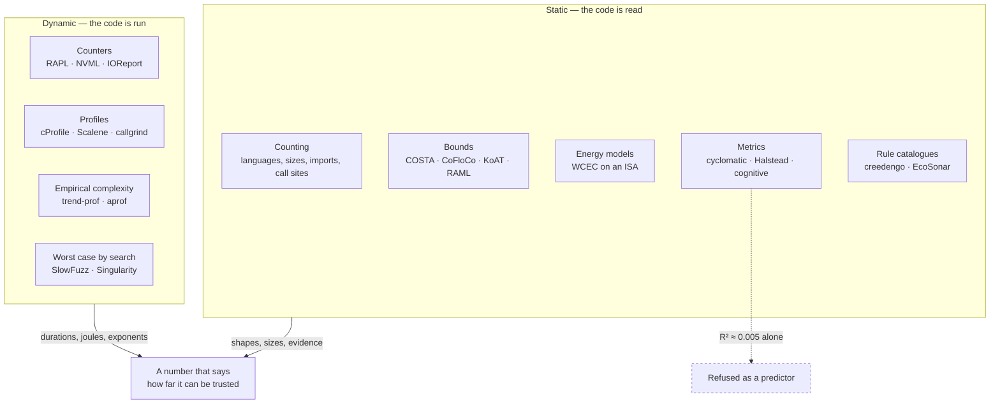

# Reading code, and running it

[🇫🇷 ANALYSE.md](ANALYSE.md) · 🇬🇧 English

Two questions sit under every cost model this package writes, and they are not
symmetric.

**Can reading a repository tell you what it costs to run?** Mostly no, and the
literature is unusually clear about why.

**Can running a repository tell you how it scales?** Yes, within the range you
ran it over, and that is worth more than it sounds.

This page is the investigation behind those two sentences: what static analysis
and dynamic analysis have actually been shown to deliver for **complexity** and
for **consumption**, with the numbers and the papers, and what of it belongs in
`saggio`. It is a reference, not a feature list. Where a technique is refused,
the refusal is argued rather than asserted.



## 1. What static analysis can and cannot be asked

### 1.1 The wall, and where it is

The general question — *how long will this program run, and how much energy will
it draw* — is not merely hard, it is undecidable. Worst-case execution time
analysis is equivalent to the halting problem in the general case, so every
sound static tool computes an **upper bound** rather than the answer, and needs
loop bounds and recursion depths supplied by a human as *flow facts* before it
can compute anything at all. This is the founding constraint of the field, set
out in [the WCET survey of Wilhelm et
al.](https://www.cs.fsu.edu/~whalley/papers/tecs07.pdf), and it is why the
industrial tools ([aiT](https://www.absint.com/ait/), OTAWA, Heptane) live in
hard real-time embedded systems where the hardware is simple enough and the
annotations are worth writing.

Nothing about a Python repository on a laptop with a GPU relaxes that
constraint. It makes it worse.

### 1.2 The serious line of work: cost and complexity bounds

There is a real, decades-deep body of work that infers symbolic resource bounds
from source, and it is worth knowing precisely what it needs.

| Family | Tools | Input it accepts | What it returns |
|---|---|---|---|
| Recurrence extraction | [COSTA](https://www.researchgate.net/publication/221047639_COSTA_Design_and_Implementation_of_a_Cost_and_Termination_Analyzer_for_Java_Bytecode), SPEED, [CoFloCo](https://arxiv.org/pdf/2202.01769), [KoAT](https://arxiv.org/pdf/2606.28542), Loopus | Java bytecode, or pointer-free C lowered to integer transition systems | Closed-form upper bound on a cost measure |
| Amortised typing | [RaML](https://www.raml.co/publications/) (Resource Aware ML), C4B | First-order functional programs, OCaml | Concrete, *non-asymptotic* polynomial bounds, inferred by linear programming |

Both families work, and both are narrow by construction. The recurrence family
is [explicitly unable to infer tight bounds for programs that are non-linearly
recursive, amortised, non-monotonic or
multiphase](https://arxiv.org/pdf/2202.01769) — even when a simple closed form
exists. The amortised family wants a typed functional language. Neither accepts
a repository whose cost is dominated by NumPy, a CUDA kernel, a database, and a
network call.

The honest summary is that these tools answer *complexity*, on program classes
that are far narrower than the ones this package audits, and they answer it
about an abstract cost measure — steps, allocations, ticks — not about joules.

### 1.3 Static energy: it exists, and it does not transfer

Static **energy** analysis is not a hypothetical. [Grech, Georgiou, Pallister,
Kerrison and Eder](https://arxiv.org/abs/1405.4565) built energy models by
characterising the energy of each instruction in a processor's instruction set,
then lifted the analysis to LLVM IR so that a high-level program structure could
be related to a low-level energy model. The follow-up work extends this to
[worst-case energy consumption with data-dependent
models](https://dl.acm.org/doi/10.1145/3078659.3078666) and examines [the value
and limits of multi-level energy analysis for deeply embedded single- and
multi-threaded programs](https://arxiv.org/pdf/1510.07095).

The precondition is a per-instruction energy model for the target. That exists
for an XMOS microcontroller. It does not exist, and will not, for a
superscalar out-of-order core with three cache levels, a memory controller, an
operating system scheduler, a garbage-collected interpreter, and a discrete
accelerator on the other side of a PCIe link.

The nearest thing at the top of that stack is static **throughput** prediction
for a single basic block: [uiCA](https://arxiv.org/abs/2107.14210) reports about
1% error against measurement on recent Intel microarchitectures, alongside
`llvm-mca`, [OSACA](https://arxiv.org/pdf/1809.00912), IACA and the learned
models [Ithemal](https://arxiv.org/abs/1808.07412) and DiffTune. One basic
block, steady state, no I/O, no allocator, no interpreter. Excellent tools,
answering a question two or three orders of magnitude smaller than "what does
this training run cost".

### 1.4 The metrics that are not complexity

Cyclomatic complexity, Halstead volume and cognitive complexity are the metrics
a repository can actually compute today — [`radon`](https://radon.readthedocs.io/)
for McCabe, Halstead and the maintainability index,
[`lizard`](https://github.com/terryyin/lizard) for cyclomatic number across
languages, [`complexipy`](https://github.com/rohaquinlop/complexipy) for
SonarSource-style cognitive complexity, and `ruff`'s `C901` for the same McCabe
count as a lint rule.

They measure how hard code is to *read and maintain*. They are not measures of
how much work it does, and the evidence on using them as energy predictors is
now specific enough to quote.

[A 2026 study of 2,786 Java
methods](https://arxiv.org/abs/2607.06124) extracted 33 static features — lines
of code, control-flow counts, internal and external calls, cyclomatic
complexity, and which standard APIs each method touches — and fitted eleven
regression models to measured energy:

- static features **alone**: R² ≈ **0.005**;
- static features **plus the logarithm of execution time**: R² = **0.46** (random
  forest, variance threshold), MAE 2.02, MAPE 1.75%;
- the three strongest predictors by SHAP, in order: `log_execution_time`,
  number of internal calls, cyclomatic complexity.

The conclusion states it plainly: *"Static source code metrics alone yield poor
predictive performance, with R² values near zero."* Earlier work is consistent
with this in the least useful way possible — the correlation between energy and
complexity metrics [ranges from none to strong depending on the
corpus](https://arxiv.org/pdf/1701.02344), which is the definition of not being
a predictor.

Cyclomatic complexity is also [strongly correlated with lines of
code](https://arxiv.org/pdf/1408.4523) and with Halstead volume, so a model
built on several of them is mostly counting the same thing several times. And
[both `radon` and `lizard` disregard Python's syntactic
sugar](https://www.arothuis.nl/posts/cyclomatic-complexity/) — `3 <= month <= 5`
scores half of `month >= 3 and month <= 5` — which is a fine property for a
maintainability score and a disqualifying one for a cost proxy.

**Verdict for `saggio`: a cyclomatic complexity number must never appear in a
cost model, in any status.** It would look exactly like a checked figure while
carrying an R² near zero against the thing this package exists to report.

### 1.5 The rule catalogues

[creedengo, formerly ecoCode](https://github.com/green-code-initiative/ecoCode),
is a collective effort publishing static analysers that flag code structures
with a plausible ecological cost, packaged as SonarQube rules across Java,
JavaScript, PHP, Python, C#, Android and iOS;
[EcoSonar](https://github.com/green-code-initiative/EcoSonar) is the audit tool
around it. The Android rule set is [grounded in a published code-smell
catalogue](https://dl.acm.org/doi/fullHtml/10.1145/3551349.3559518).

This is useful work and the direction of travel is right. Two things have to be
said about it anyway. The rules encode *good practice catalogues*, not measured
deltas — the repository itself carries the warning that the project is at a very
early stage — and a rule count is not a quantity. "Seventeen eco-design
findings" is not joules, not grams, and not comparable between two repositories.

Where a rule is unambiguous and cheap, the pattern worth borrowing is the one
this package already uses for API calls: **quote the line, name the practice,
and attach no number.** A finding with a file and a line number is evidence a
reader can check. A finding with a score is a number nobody can check.

### 1.6 So what is static analysis actually good for here?

Everything in the list below is deterministic, checkable, and already the
division of labour `saggio` keeps — the static pass owns the counting, and never
owns a wattage:

- **What the repository is**: languages by extension weight, archetype, which
  compute frameworks are imported and whether they are imported by the workload
  or only by the test suite.
- **How much work a full run performs**: the declared work size, collected from
  every place it is stated, with precedence made explicit and disagreements
  recorded rather than silently resolved. This is what makes a capped slice a
  *fraction* rather than a guess.
- **Which paid services are called, and on which line**: evidence with a file
  and a line number, priced from a sourced catalogue.
- **Analytic operation counts, where the arithmetic is published.** For a
  transformer, total training compute is approximated as `FLOPs ≈ c · N · D`
  over parameters and tokens, with `c` [between 5 and 8 and 6 taken as a
  conservative baseline](https://arxiv.org/html/2511.17031v2). When a repository
  declares its parameter count and its token budget, that is arithmetic over two
  declared numbers and a sourced coefficient — `estimated`, with its source, and
  never `measured`.
- **Whether the work is compute-bound or memory-bound.** The [roofline
  model](https://docs.nersc.gov/tools/performance/roofline/) compares arithmetic
  intensity, in FLOP per byte moved, against the machine's own ratio of peak
  throughput to peak bandwidth. This is not a curiosity: `saggio` already
  reports a *bracket* rather than a number when projecting onto another
  accelerator, because the compute ratio and the bandwidth ratio differ by more
  than a factor of two between an A100 and an H100.

The reason that last point matters is physical, and it is the single most
useful number in this whole document. In [Horowitz's 45 nm
figures](https://gwern.net/doc/cs/hardware/2014-horowitz-2.pdf) at 0.9 V, a
floating-point operation costs **0.4–3.7 pJ**, a cache access **10–100 pJ**, and
an off-chip 64-bit DRAM access **1300–2600 pJ**. Moving a word from memory costs
three orders of magnitude more than multiplying it. Any static estimate built on
operation counts alone is counting the cheap part.

Which is also why FLOP counters mislead when read as cost. [`fvcore`](https://github.com/facebookresearch/fvcore/blob/main/docs/flop_count.md),
[`torch.utils.flop_counter`](https://github.com/pytorch/pytorch/blob/main/torch/utils/flop_counter.py)
and the [DeepSpeed flops
profiler](https://www.deepspeed.ai/tutorials/flops-profiler/) are accurate at
what they do, with three caveats worth carrying: a custom module needs its own
counter or it counts as zero, DeepSpeed *assumes* the backward pass costs twice
the forward, and token-by-token generation with a KV cache is generally out of
scope. Add to that the finding that [FLOP count is poorly correlated with GPU
latency](https://dev-discuss.pytorch.org/t/the-ideal-pytorch-flop-counter-with-torch-dispatch/505),
and a FLOP total is best understood as a *description of the work*, not a
prediction of its cost.

## 2. What dynamic analysis can and cannot be asked

### 2.1 The counters, and how far they can be trusted

`saggio` reads energy counters directly: powercap/RAPL zones by name on Linux,
`IOReport` on Apple Silicon, NVML through the NVIDIA driver, and `amdgpu` /
`i915` / `xe` through sysfs. The reference study for how far any of this can be
trusted is [Jay, Ostapenco, Lefèvre, Trystram, Orgerie and Fichel, CCGrid
2023](https://perso.ens-lyon.fr/laurent.lefevre/pdf/CCGRID2023_Ostapenco_Jay_Lefevre.pdf),
which compared nine software power meters — CarbonTracker, CodeCarbon, Energy
Scope, Experiment Impact Tracker, `perf`, PowerAPI, Scaphandre, Green Algorithms
and ML CO2 Impact — against high-precision physical meters on Grid'5000.

What they found, in the order it matters:

- **The shape is right.** Pearson correlation with the wall meter is **0.93 to
  0.956** across tools. A software power meter tracks what the machine is doing.
- **The level is not, and the gap is not a constant.** Regressing the external
  meter on the tools gives a slope of **1.17** on CPU benchmarks and **1.18** on
  GPU benchmarks. Their conclusion: *"estimating the total power consumption
  from the power reported by the tools can't be done by only adding a constant
  offset"*, and the relation *"must be studied for each compute node
  architecture or even for each individual compute node"*.
- **Nothing measures the node.** *"No software-based power meter allows one to
  exactly measure the complete energy or the power consumed by the computing
  node while executing a workload."* Fans, storage, network interfaces and the
  power supply are outside RAPL and NVML by construction.
- **Measuring is cheap at sane rates.** Energy overhead under 1% on average,
  about 2% at worst; PowerAPI's CPU overhead peaks at 3.7% at 10 Hz.
- **Per-process attribution is the weak link.** PowerAPI handled 4 parallel
  processes correctly (18 after the authors reported the bug), Scaphandre more
  than 100; and on *non-identical* parallel workloads the two tools disagreed
  about which process was drawing more, with no reference available to settle it.

This is the empirical basis for two rules already enforced in this package: a
reading carries the **scope** of what it covered, and a package figure is never
presented as the cost of a run that was dominated by an accelerator.

### 2.2 The cost of measuring

Sampling rate is not a free parameter. A [2026 study of seven RAPL-based
tools](https://arxiv.org/pdf/2604.26815) polling at 1 kHz found time overheads
ranging from **0.25% to 46.75%**, with CodeCarbon between **5.38% and 46.75%**
and a measured energy overhead **exceeding 40%** in one configuration; the cause
is system-call cost, not the counter — reading the MSR directly costs 2.4% of
the syscall path. At 1 Hz the same authors call the overhead negligible.

The design consequence is blunt: **a fast sampler distorts the thing it
measures**, and the distortion lands on wall time, which then multiplies through
every energy, carbon and money figure downstream. Prefer accumulating counters
read twice — RAPL, NVML's energy counter, `IOReport` — over sampled wattage, and
keep any sampler that is unavoidable slow. [CodeGreen](https://arxiv.org/html/2603.17924)
shows what careful engineering buys at method granularity: instrumentation
decoupled from measurement through a lock-free buffer, R² = 0.9934 against RAPL,
10.9% mean absolute error, and overhead still **1.5–11.3%**.

The same caveat governs profilers, and `saggio` already states it: a run taken
with `cProfile` attached reports an inflated wall time, because the profiler
charges per call. Sampling profilers ([Scalene](https://www.usenix.org/conference/osdi23/presentation/berger),
`py-spy`, `pyinstrument`) trade exactness for a much lower disturbance, and
Scalene additionally separates time spent in Python from time spent in native
code — the distinction that decides whether a hot line is worth rewriting. At
the other extreme, instrumentation-based tools are honest about their price:
`aprof`, below, runs at a **mean 30.6× slowdown, peaking at 78.3×**.

### 2.3 Measuring complexity by running the thing

This is the part of the literature that is directly useful here, and it is
older and better than its visibility suggests.

**[trend-prof](https://theory.stanford.edu/~aiken/publications/papers/fse07.pdf)**
(Goldsmith, Aiken and Wilkerson, FSE 2007) measures *empirical computational
complexity*. You run a program over workloads spanning orders of magnitude, you
describe each workload with numerical **features** you choose — number of
records, file size, node count — and the tool fits each basic block's execution
count against each feature with a linear model `y = a + bx` and a power law
`y = a·x^b`, reporting R² for the fit. Blocks whose costs move together are
grouped into **clusters**, so the output is a handful of scaling behaviours
rather than thousands of counters. The exponent `b` is the answer: an empirical
scaling exponent, over the range actually exercised, with a goodness-of-fit
attached.

**[aprof](http://season-lab.github.io/papers/pldi055-coppa.pdf)** (Coppa,
Demetrescu and Finocchi, PLDI 2012) removes the need to choose features. Its
insight is *read memory size*: the number of distinct memory cells a routine
invocation reads for the first time. For a routine that reads its input at least
once, RMS approximates the true input size within constant factors, so the
profiler can plot cost against input size for every routine automatically. The
authors are equally clear about where it fails — RMS counts distinct cells, so a
computation whose cost is driven by a *value* rather than by memory read
(the naive factorial of `n`) is invisible to it, and binary search over an array
reads only O(log n) cells.

**[BigO(Bench)](https://arxiv.org/abs/2503.15242)** (2025) brings the same idea
to Python at scale: tooling that infers the time and space complexity of an
arbitrary Python function from profiling measurements by scaling inputs and
fitting candidate curves, used to annotate 3,105 problems and 1,190,250
solutions. Its companion finding is a caution about the shortcut: language
models are markedly weaker at *generating* code to a complexity target than at
predicting complexity, and prediction itself is far from solved —
[CodeComplex](https://arxiv.org/abs/2401.08719) exists precisely because it is
hard. A complexity class guessed by a model is not evidence.

**Worst case by search.** Average behaviour is not the risk; the input that
triggers the quadratic path is. [SlowFuzz](https://www.researchgate.net/publication/319327715_SlowFuzz_Automated_Domain-Independent_Detection_of_Algorithmic_Complexity_Vulnerabilities)
evolves inputs towards higher cost, [PerfFuzz](https://arxiv.org/pdf/1807.02863)
does it against multiple objectives at once, and
[Singularity](https://www.cs.utexas.edu/~isil/fse18.pdf) searches for an input
*pattern* rather than an input, synthesising it as a recurrent computation graph
via genetic programming — which is what lets it report an asymptotic class
rather than one slow example.

### 2.4 Attribution, and why it is harder than measurement

Measuring a machine is easier than measuring a process on it.
[pyJoules](https://github.com/powerapi-ng/pyJoules) wraps a Python function in a
decorator and is explicit that what it returns is *the whole machine's* energy
during the window, operating system and neighbours included.
[JoularJX](https://joular.github.io/joularjx/) attaches to the JVM and attributes
down to the method, using RAPL on Linux, `powermetrics` on macOS and a custom
monitor on Windows. [Kepler](https://sustainable-computing.io/) attributes to
containers and pods and recently [moved off eBPF to plain `/proc` and `/sys`
reads](https://ascii.co.uk/news/article/news-20260701-2c378902/kepler-rewrites-power-monitoring-architecture-ditches-ebpf),
dropping its `CAP_BPF` and `CAP_SYSADMIN` requirements — the same
least-privilege instinct that makes this package print the remedy for a
root-only counter instead of performing it.

Attribution is a model on top of a measurement, and the CCGrid result above is
the reason to hold it at arm's length: two mature tools, given two different
processes running side by side, ranked them in opposite orders.

### 2.5 Determinism, for a gate that must not flake

A build gate that fails on noise gets disabled within a week. Wall-clock
measurements on shared runners move by a few percent between runs of
byte-identical builds, which puts a hard floor under any threshold expressed in
time. The standard answer is to gate on a deterministic proxy instead:
[Cachegrind and Callgrind](https://valgrind.org/docs/manual/cl-manual.html)
count instructions executed under simulation, and the count is reproducible.

This is a proxy for work, not for energy — it knows nothing about frequency,
memory stalls, or an idle accelerator — but it is exactly the right shape for a
regression gate that has to distinguish a change from a fluctuation. The
research direction is live: whether [developers' own tests can spot energy
regressions](https://arxiv.org/abs/2108.05691) has been studied and replicated
industrially, and [EnergyTrackr](https://arxiv.org/html/2604.19373) mines
commits, profiles energy per commit, and applies statistical testing before
blaming a change.

## 3. The bridge between the two: why time carries the weight

The two families meet at one equation, which is the one this package already
uses: energy is average power multiplied by duration. The useful question is how
much of the variance each factor carries.

The strongest recent evidence is a critique of the best-known result in the
field. [*It's Not Easy Being Green: On the Energy Efficiency of Programming
Languages*](https://arxiv.org/html/2410.05460v1) re-examines the widely cited
[ranking of languages by energy
efficiency](https://haslab.github.io/SAFER/scp21.pdf) and finds the ranking
measures something other than language:

- languages are conflated with their implementations (Ruby and JRuby counted as
  two languages);
- the "same algorithm" benchmarks differ in parallelism, vectorisation and
  third-party libraries — the C++/C regex gap of 8.9× comes from PCRE versus
  Boost, not from the languages;
- JIT warm-up dominates short runs: first iterations up to **3×** slower, and
  averaging over ten or more iterations improves measured energy efficiency by
  **80%**;
- core count dominates power, roughly **P(x) ≈ 30·log₂(x) + 242 W**, so a
  benchmark that happens to be parallel in one language and sequential in
  another is not a language comparison at all;
- within one source language, implementation choice moves the result: PyPy about
  1.25× over CPython, LuaJIT about 5× over the Lua interpreter.

Their conclusion, controlled for the above: *"the choice of programming language
implementation has no significant impact on energy consumption beyond execution
time"*, and the advice that follows is to optimise performance rather than shop
for a language.

That is a strong statement for the design of this package, and it should not be
over-read. Time is not a complete substitute for energy:

- across multiple cores the correlation weakens, because parallel execution cuts
  runtime much faster than it cuts energy;
- a [controlled study of Java garbage collection across
  workloads](https://arxiv.org/pdf/2608.19520) found only r = 0.33 between
  runtime and energy, leaving most of the variation unexplained;
- race-to-idle and frequency scaling mean a faster run can draw disproportionately
  more power while it lasts.

So the defensible position — and it is the one already encoded in this
package — is that **duration is the variable worth measuring hardest**, average
power is the variable worth *reading off a counter* wherever the machine allows
it and off a sourced catalogue otherwise, and neither may be inferred from the
shape of the source text.

This is also the shape the standards have settled on. The [Software Carbon
Intensity specification](https://greensoftware.foundation/standards/sci/), now
[ISO/IEC 21031:2024](https://greensoftware.foundation/articles/sci-specification-achieves-iso-standard-status/),
defines a **rate** — emissions per functional unit — rather than a total, which
is the same commitment as this package's insistence on a declared unit of work,
and the reason `saggio dashboard` refuses to compare per-unit costs across
projects whose units differ.

One last data point on how far apart honest people can be about the same
quantity: for the energy of a single language-model query, OpenAI has stated
about **0.34 Wh** with no measurement boundary given, Mistral and ADEME published
**1.14 gCO2e** for a 400-token response without a Wh figure, and a 2026 analysis
in *Joule* argues widely cited per-query figures are overstated by **4× to 20×**
relative to production deployments, putting Llama 3.1 405B at a median 0.39 Wh.
Three sourced numbers, three boundaries, no way to compare them. The cost of an
API call is a `TODO` with a source attached, not an average.

## 4. What this means for `saggio`

The technique-by-technique verdict, with the status each output could honestly
carry.

| Technique | What it yields | Status it may carry | Verdict |
|---|---|---|---|
| Declared work size, frameworks, service call sites | Evidence with a file and a line | `estimated` at most, usually no number at all | **Shipped.** This is what the static pass is for. |
| Empirical scaling exponent from repeated slices | `b` in `y = a·x^b`, with R² | `measured` over the range run; any projection beyond it stays `estimated` | **Adopt.** Highest value of anything in this document. |
| Energy counters, read twice, at low rates | Joules, with a scope | `measured` | **Shipped.** Keep samplers slow; prefer accumulating counters. |
| Instruction counts under Cachegrind | A deterministic work proxy | `measured` as a count; never converted to energy | **Adopt later**, for `diff` gates. Linux-only, refuse elsewhere. |
| Analytic FLOPs from declared parameters and tokens | `FLOPs ≈ 6·N·D` | `estimated`, with the coefficient's source | **Adopt** where the repository declares both. |
| Roofline bracket, compute- versus memory-bound | An interval, not a number | `estimated` | **Shipped**, in the accelerator projection. |
| Static cost-bound tools (COSTA, RaML, KoAT) | Symbolic bounds on abstract cost | n/a | **Refuse.** Program classes do not intersect what is audited here. |
| Static energy models (WCEC on an ISA) | Joules per instruction | n/a | **Refuse.** No per-instruction model exists for the targets. |
| Cyclomatic / cognitive complexity as a cost figure | A metric with R² ≈ 0.005 against energy | none | **Refuse outright.** It would look like a checked number. |
| Rule-catalogue findings (creedengo-style) | Named practice, file, line | no number | **Adopt the shape, not the score**, if adopted at all. |
| Complexity predicted by a language model | A class label | none | **Refuse.** A number nobody can check. |

### The one change worth making

`project_to_completion` currently scales a measured slice to a whole run and
records the assumption it rests on — that the work is uniform. Nothing checks
that assumption, and when it is wrong it is wrong by a power, not by a margin.

trend-prof's method turns it into something checkable, and the repository
already supplies the missing ingredient. The static pass reads the declared work
size; a slice can therefore be run at **three or more sizes** rather than one,
and wall time fitted against size as `y = a·x^b`:

- `b ≈ 1` confirms the uniformity assumption and the existing projection stands,
  now with evidence behind it;
- `b ≈ 2` says the projection understates the whole run by the ratio of the
  sizes, and by how much exactly;
- a poor fit says the slice is not representative, which is a finding, and the
  projection should refuse rather than extrapolate a curve nobody believes.

The exponent is `measured` over the sizes actually run. The projection beyond
them stays `estimated`, because it always was. The cost is a handful of extra
short runs, which is the cheapest evidence in this entire document — and it is
the only technique here that turns one of this package's standing assumptions
into a number with a goodness-of-fit attached.

```bash
saggio power --seconds 5                                   # what this machine will tell you
saggio audit . --country FR --run -o cost_of_running.yaml  # read it, then run a capped slice
saggio measure --units 1000 --fraction 0.01 -- python train.py --steps 100
```

## Sources

**Static bounds and worst-case analysis**

- Wilhelm et al., [*The Worst-Case Execution Time Problem — Overview of Methods and Survey of Tools*](https://www.cs.fsu.edu/~whalley/papers/tecs07.pdf), ACM TECS 2008.
- Albert et al., [*COSTA: Design and Implementation of a Cost and Termination Analyzer for Java Bytecode*](https://www.researchgate.net/publication/221047639_COSTA_Design_and_Implementation_of_a_Cost_and_Termination_Analyzer_for_Java_Bytecode).
- Giesl et al., [*KoAT: Automatic Complexity and Termination Analysis of Integer Programs*](https://arxiv.org/pdf/2606.28542); [*Improving Automatic Complexity Analysis of Integer Programs*](https://arxiv.org/pdf/2202.01769).
- Hoffmann et al., [Resource Aware ML and automatic amortised resource analysis](https://www.raml.co/publications/).

**Static energy**

- Grech, Georgiou, Pallister, Kerrison, Eder, [*Static Analysis of Energy Consumption for LLVM IR Programs*](https://arxiv.org/abs/1405.4565), SCOPES 2015.
- [*Data Dependent Energy Modeling for Worst Case Energy Consumption Analysis*](https://dl.acm.org/doi/10.1145/3078659.3078666), SCOPES 2017.
- [*On the Value and Limits of Multi-level Energy Consumption Static Analysis*](https://arxiv.org/pdf/1510.07095).

**Static throughput**

- Abel and Reineke, [*uiCA: Accurate Throughput Prediction of Basic Blocks on Recent Intel Microarchitectures*](https://arxiv.org/abs/2107.14210), ICS 2022.
- Laukemann et al., [*Automated Instruction Stream Throughput Prediction (OSACA)*](https://arxiv.org/pdf/1809.00912).

**Metrics, and what they do not predict**

- [*Static Metrics Are Insufficient: Predicting Java Method Energy Usage with Execution Time*](https://arxiv.org/abs/2607.06124), 2026.
- Shepperd, [*A critique of cyclomatic complexity as a software metric*](https://www.cs.du.edu/~snarayan/sada/teaching/COMP3705/lecture/p1/cycl-1.pdf).
- [radon](https://radon.readthedocs.io/) · [lizard](https://github.com/terryyin/lizard) · [complexipy](https://github.com/rohaquinlop/complexipy).

**Rule catalogues**

- [creedengo / ecoCode rules](https://github.com/green-code-initiative/ecoCode) · [EcoSonar](https://github.com/green-code-initiative/EcoSonar).
- [*ecoCode: a SonarQube Plugin to Remove Energy Smells from Android Projects*](https://dl.acm.org/doi/fullHtml/10.1145/3551349.3559518).

**Measuring energy**

- Jay, Ostapenco, Lefèvre, Trystram, Orgerie, Fichel, [*An experimental comparison of software-based power meters: focus on CPU and GPU*](https://perso.ens-lyon.fr/laurent.lefevre/pdf/CCGRID2023_Ostapenco_Jay_Lefevre.pdf), CCGrid 2023.
- [*What Is the Cost of Energy Monitoring? An Empirical Study on the Overhead of RAPL-Based Tools*](https://arxiv.org/pdf/2604.26815), 2026.
- [*CodeGreen: Towards Improving Precision and Portability in Software Energy Measurement*](https://arxiv.org/html/2603.17924), 2026.
- [pyJoules](https://github.com/powerapi-ng/pyJoules) · [JoularJX](https://joular.github.io/joularjx/) · [Scaphandre](https://github.com/hubblo-org/scaphandre) · [PowerAPI](https://powerapi.org/) · [Kepler](https://sustainable-computing.io/).

**Profiling and empirical complexity**

- Berger et al., [*Triangulating Python Performance Issues with Scalene*](https://www.usenix.org/conference/osdi23/presentation/berger), OSDI 2023.
- Goldsmith, Aiken, Wilkerson, [*Measuring Empirical Computational Complexity*](https://theory.stanford.edu/~aiken/publications/papers/fse07.pdf), FSE 2007.
- Coppa, Demetrescu, Finocchi, [*Input-Sensitive Profiling*](http://season-lab.github.io/papers/pldi055-coppa.pdf), PLDI 2012.
- [*BigO(Bench): Can LLMs Generate Code with Controlled Time and Space Complexity?*](https://arxiv.org/abs/2503.15242) · [CodeComplex](https://arxiv.org/abs/2401.08719).
- [SlowFuzz](https://www.researchgate.net/publication/319327715_SlowFuzz_Automated_Domain-Independent_Detection_of_Algorithmic_Complexity_Vulnerabilities) · [Singularity](https://www.cs.utexas.edu/~isil/fse18.pdf) · [Callgrind](https://valgrind.org/docs/manual/cl-manual.html).

**Energy, time, and the standards**

- [*It's Not Easy Being Green: On the Energy Efficiency of Programming Languages*](https://arxiv.org/html/2410.05460v1), 2024.
- Pereira et al., [*Ranking Programming Languages by Energy Efficiency*](https://haslab.github.io/SAFER/scp21.pdf), SCP 2021.
- Horowitz, [*Computing's Energy Problem (and what we can do about it)*](https://gwern.net/doc/cs/hardware/2014-horowitz-2.pdf), ISSCC 2014.
- Lannelongue, Grealey, Inouye, [*Green Algorithms*](https://doi.org/10.1002/advs.202100707), Advanced Science 2021 — the arithmetic this package implements, extracted in [`skills/saggio/references/green-algorithms.md`](skills/saggio/references/green-algorithms.md).
- [Software Carbon Intensity](https://greensoftware.foundation/standards/sci/), ISO/IEC 21031:2024.
- [*Can We Spot Energy Regressions using Developers' Tests?*](https://arxiv.org/abs/2108.05691) · [EnergyTrackr](https://arxiv.org/html/2604.19373).

---

[`LANDSCAPE.md`](LANDSCAPE.md) places this package among the tools named above.
[`skills/saggio/references/honesty-taxonomy.md`](skills/saggio/references/honesty-taxonomy.md)
is the rule every verdict in section 4 was measured against.
