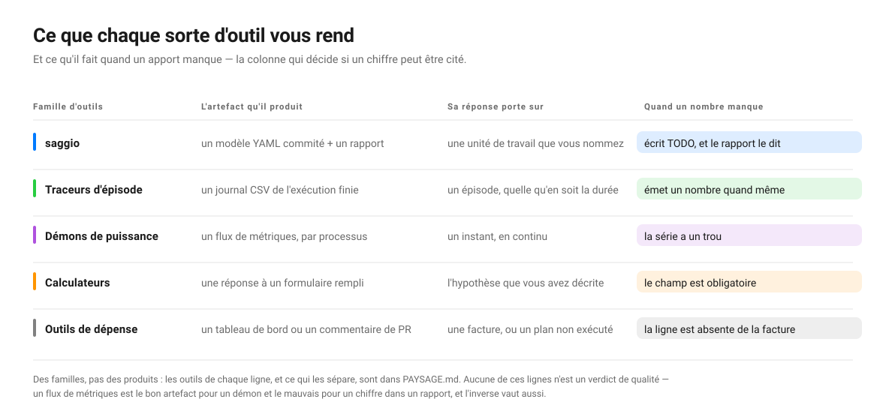

# Galerie

🇫🇷 Français · [🇬🇧 GALLERY.md](GALLERY.md)

Des modèles de coût que cet outil a produits, sur des dépôts que vous pouvez aller
lire. Chaque fichier sous [`examples/`](examples/) a été engendré par la commande
imprimée au-dessus de lui, et chacun est commité avec son rapport rendu à côté.

**Aucun de ces chiffres n'est une affirmation de coût.** Ce sont des modèles tels
que `saggio audit` les écrit avant qu'un humain n'y touche : les nombres coûteux
sont encore ouverts, l'unité de travail est une proposition, et la machine décrite
est celle qui a fait l'audit, pas celle qui exécute le code. Ce dernier point
compte ici plus qu'ailleurs, car ces dépôts ont été clonés et lus sur un portable.
Chaque modèle le dit, dans `deployment.machine_provenance`. La valeur de la
galerie n'est pas dans les nombres. Elle est dans ce que l'outil établit, ce qu'il
refuse d'établir, et là où il se trompe.

Régénérez n'importe lequel :

```bash
saggio audit https://github.com/karpathy/nanoGPT --country FR --no-llm -o examples/nanoGPT.yaml
saggio render examples/nanoGPT.yaml -f md -o examples/nanoGPT.md
```

## Les huit dépôts

| Modèle | Dépôt | Lu comme | Ce qui est intéressant |
|---|---|---|---|
| [`nanoGPT`](examples/nanoGPT.yaml) · [rapport](examples/nanoGPT.md) | `karpathy/nanoGPT` | entraînement | Deux désaccords sur la longueur d'une exécution, tous deux rapportés |
| [`whisper`](examples/whisper.yaml) · [rapport](examples/whisper.md) | `openai/whisper` | outil en ligne de commande | Rien d'inventé : ni modèle, ni service, ni durée d'exécution |
| [`dinov2`](examples/dinov2.yaml) · [rapport](examples/dinov2.md) | `facebookresearch/dinov2` | entraînement | Sept fichiers se contredisent sur la longueur d'une exécution |
| [`fastapi`](examples/fastapi.yaml) · [rapport](examples/fastapi.md) | `fastapi/fastapi` | outil en ligne de commande | Sa suite de tests est distinguée de son code |
| [`airflow`](examples/airflow.yaml) · [rapport](examples/airflow.md) | `apache/airflow` | service | Neuf langages, huit services payants, trente-six modèles |
| [`saggio`](examples/saggio.yaml) · [rapport](examples/saggio.md) | ce dépôt-ci | outil en ligne de commande | Tout ce qu'il semble appeler, il ne l'appelle que dans ses tests |

| [`detectron2`](examples/detectron2.yaml) · [rapport](examples/detectron2.md) | `facebookresearch/detectron2` | inférence | Le premier exemple lu comme inférence, et rien d'inventé pour le remplir |
| [`xberg`](examples/xberg.yaml) · [rapport](examples/xberg.md) | `xberg-io/xberg` | service | Quatorze langages, dont 3,6 % seulement de Python |
### nanoGPT — la taille d'une exécution n'est pas un seul nombre

Lu comme une charge d'**entraînement** important PyTorch, transformers et NumPy.
Une exécution complète fait `600000` itérations, d'après `train.py::max_iters`.
Trois autres fichiers du même dépôt disent autre chose, et le modèle le dit au lieu
de trancher :

> `max_iters` est énoncé plusieurs fois et les énoncés se contredisent
> (`train.py` dit 600000 ; `config/finetune_shakespeare.py` dit 20 ;
> `config/train_gpt2.py` dit 600000 ; `config/train_shakespeare_char.py` dit
> 5000). `train.py::max_iters` a été retenu ; vérifiez que c'est celui qu'une vraie
> exécution lit.

Cette phrase est le produit. Un outil qui aurait choisi en silence se tromperait
d'un facteur trente mille sur la configuration au niveau caractère, et personne ne
le saurait.

### whisper — bien lu, et rien d'ajouté

Lu comme un **outil en ligne de commande** important PyTorch, NumPy et ffmpeg,
c'est-à-dire ce que Whisper est. Aucun service payant, aucun identifiant de
modèle, aucune durée d'exécution : le code de Whisper n'en énonce aucun, donc le
modèle n'en énonce aucun non plus.

Cette réponse vide a demandé une correction. Une version antérieure de cette page
rapportait un modèle nommé `Whisper`, depuis `whisper/decoding.py:20` :

```python
model: "Whisper", mel: Tensor, tokenizer: Tokenizer = None
```

C'est une annotation de type dans une signature de fonction. Python n'a pas de
clés de dictionnaire sans guillemets : un deux-points après un nom nu est une
annotation, jamais un modèle choisi. Le détecteur connaît maintenant la
différence, et la ligne ci-dessus ne trouve plus rien.

### dinov2 — l'outil en a choisi un, et dit d'aller vérifier

Lu comme de l'**entraînement**, et comme limité par le calcul, ce qui autorise la
projection sur un autre accélérateur. Sept fichiers énoncent un nombre d'époques et
se contredisent : les configurations d'entraînement disent 400 et 500, la
configuration SSL par défaut dit 100, les scripts d'évaluation disent 10 et 30. Il
retient `configs/train/cell_dino/vitl16_boc_hpafov.yaml`, et liste les six autres.

Il retenait auparavant `configs/eval/...`, une configuration d'*évaluation*, parce
que la règle était alphabétique et qu'`eval` se classe avant `train`. Un dépôt qui
sépare `configs/train` de `configs/eval` vous dit laquelle des deux une vraie
exécution lit, et la règle l'écoute désormais : un répertoire d'entraînement prime
sur un répertoire neutre, qui prime sur un répertoire d'évaluation, de banc d'essai
ou d'exemples.

Entre quatre configurations d'entraînement, c'est encore alphabétique, et 400
contre 500 est une vraie ambiguïté que ceci ne peut pas trancher. Ce qu'il fait à
la place : nommer le fichier utilisé et les six autres, pour que la question se
trouve d'un coup d'œil.

### fastapi — la suite n'est pas la charge de travail

Lu comme un **outil en ligne de commande**, 1138 fichiers Python, aucun framework
de calcul. Il trouve trois identifiants de modèle, et tous les trois arrivent avec
une réserve :

```yaml
- model: alexnet
  detected_at: tests/test_tutorial/test_path_params/test_tutorial005.py:12
  caveat: Found only in the code that tests this repository, so it may not be part
    of the workload. Confirm before pricing it.
```

`alexnet`, `lenet` et `resnet` sont des chaînes dans un test de tutoriel. Ils sont
rapportés, parce que les faire disparaître en silence serait une autre forme de
malhonnêteté, et ils sont signalés, parce que FastAPI ne les appelle pas.

Il y en avait un quatrième, `Body_`, venu de `model_name = "Body_" + name` dans les
entrailles de FastAPI. Une chaîne littérale avec un `+` contre elle est un fragment
en cours de construction, pas un modèle nommé, et le détecteur le dit maintenant.

### airflow — le test de résistance

Neuf langages. 7920 fichiers Python, 1112 TypeScript, et derrière eux du Go, du
Kotlin, du Java, du Shell, du JavaScript et du Scala. Huit services payants
détectés avec la ligne qui prouve chacun, de
`providers/anthropic/.../operators/agent.py:36` à
`providers/sendgrid/.../emailer.py:28`. Trente-cinq identifiants de modèle, de
`claude-opus-4-8` à `bedrock:us.anthropic.claude-opus-4-5`, chacun avec la ligne
qui le nomme.

Aucune taille d'exécution : rien dans Airflow n'en énonce une, donc `total_work`
est absent plutôt que deviné. C'est la bonne réponse pour un orchestrateur, qui n'a
pas de durée d'exécution propre.

### saggio — l'outil s'auditant lui-même

Tout ce que ce paquet semble appeler, il ne l'appelle que dans ses propres tests :
un service et trois identifiants de modèle, les quatre portant la réserve. Son
unique framework, `ffmpeg`, vient de la clé citée `"ffmpeg"` dans sa propre table
de détection. Un dépôt qui contient des tables de détection se détecte lui-même :
c'est inhérent, et c'est dit plutôt que caché.

Sa durée d'exécution, `num_samples: 5000`, vient de
`examples/walkthrough/counter/config.py` — le dépôt jouet plus bas sur cette page.
Rien d'autre dans ce paquet n'énonce la quantité de travail d'une exécution : le
seul énoncé l'emporte donc. C'est la bonne réponse à la question posée et la
mauvaise à la question visée, et le modèle nomme le fichier : la différence est à
une ligne de là.

### detectron2 — le premier lu comme inférence

Lu comme **inférence**, ce qu'aucun exemple précédent n'était. Les six d'avant
couvraient l'entraînement deux fois, un service une fois et un outil en ligne de
commande trois fois : l'archétype qui compte le plus pour qui tarifie une requête
n'avait jamais été exercé. 497 fichiers Python aux côtés de C, C++ et Shell ;
PyTorch et NumPy trouvés, et rien d'autre affirmé.

Ce qui mérite le regard, c'est tout ce que ce modèle laisse ouvert. Aucun point
d'entrée trouvé, donc pas d'exécution à chronométrer ; aucun identifiant de
modèle ni service payant nommé, donc rien à tarifer ; la taille de travail n'est
pas énoncée, donc la durée reste `TODO`. Un outil soucieux de paraître utile
aurait rempli tout cela depuis le zoo de modèles de la documentation. Celui-ci
rapporte une main vide, ce qui est la lecture honnête d'un *cadriciel* de
détection : ce qu'il coûte dépend entièrement du modèle qu'on lui donne, et le
dépôt ne choisit pas à votre place.

### xberg — quatorze langages, dont 3,6 % de Python

Tous les autres exemples de cette galerie sont des dépôts Python. Celui-ci est
[xberg](https://github.com/xberg-io/xberg) — anciennement Kreuzberg, ce que la
redirection indique toujours — un moteur d'intelligence documentaire dont le
cœur est en Rust, avec des liaisons pour quinze langages. Le lecteur trouve 2 278
fichiers Rust, 435 Java, 400 C#, 391 Kotlin et 143 Python, et le rapporte comme
mixte plutôt que de le réduire au langage le plus présent. C'est la promesse que
[`PAYSAGE.md`](PAYSAGE.md) fait sur l'étendue, démontrée sur un dépôt qui aurait
pu la mettre en défaut.

**Il a aussi cassé deux choses, depuis corrigées.** La règle de détection de
suite était de forme Python et JavaScript : `tests/`, `test_*.py`, `*.test.ts`.
Rust met ses tests dans un *fichier* nommé `tests.rs`, si bien que dix
identifiants nommés `test-model` ou `mock-model` arrivaient sans la moindre mise
en garde. La règle reconnaît désormais une suite quelle que soit sa langue, et
refuse `latest.rs` et `contest.py`, qu'une première tentative trop lâche avait
emportés.

**Et une qui n'est pas corrigée, et qui est nommée ici plutôt que cachée.** Rust
garde ses tests unitaires *à l'intérieur* du fichier qu'ils testent, dans un bloc
`#[cfg(test)] mod tests`. Une détection au niveau du fichier ne peut pas voir
cela, si bien que des fixtures comme `trusted/model` et `gpt-test` figurent
encore à côté des vrais `openai/gpt-4o` et `anthropic/claude-sonnet-4-20250514`
que ce moteur appelle réellement. Lire à l'intérieur d'un fichier pour y trouver
un module de test en ligne est un travail autre, et plus grand, que lire son nom.

## La démonstration pas à pas : une charge, quatre étapes

[`examples/walkthrough/`](examples/walkthrough/) emmène un dépôt minuscule de rien
jusqu'à un modèle commité, dans l'ordre où un mainteneur le fait vraiment.

| Étape | Fichier | Ce qui a changé |
|---|---|---|
| 1 | [`1-as-read.yaml`](examples/walkthrough/1-as-read.yaml) | L'audit, sans rien exécuter. Tous les coûts sont `TODO`. |
| 2 | [`2-measured.json`](examples/walkthrough/2-measured.json) | Une vraie mesure `saggio measure` sur une tranche de 500 échantillons. |
| 3 | [`3-measured.yaml`](examples/walkthrough/3-measured.yaml) | La mesure intégrée, et une exécution complète projetée à partir d'elle. |
| 4 | [`4-diff.txt`](examples/walkthrough/4-diff.txt) | Ce que `saggio diff` rapporte entre le premier et le troisième. |
| 5 | [`5-run.yaml`](examples/walkthrough/5-run.yaml) | `saggio audit --run --scaling-steps 3` : lire, mesurer et ajuster en une commande. |

```bash
saggio audit examples/walkthrough/counter --country FR --no-llm -o examples/walkthrough/1-as-read.yaml
saggio measure --no-profile --json --into ../3-measured.yaml --units 500 -- python predict.py --num_samples 500
saggio diff examples/walkthrough/1-as-read.yaml examples/walkthrough/3-measured.yaml
```

Les étapes deux et trois sortent de la même commande. `--into` écrit la durée
mesurée dans le modèle et recalcule tout ce qui en découle, c'est-à-dire la partie
que personne ne réussit à la main : coller une durée dans un fichier YAML laisse
l'énergie, l'argent et le carbone sur leurs anciennes valeurs, et un modèle dont
l'énergie ne correspond plus à sa durée est pire qu'un modèle qui n'avait ni l'une
ni l'autre, parce qu'il a l'air fini. `--units 500` dit que la commande a effectué
cinq cents unités de travail : le chiffre enregistré est donc par unité.
`saggio audit --run` fait la lecture et l'exécution en une seule étape, et demande
votre accord d'abord, parce que ce chemin-là exécute le code du dépôt étudié.

La leçon est dans le diff, et sa première ligne mérite d'être lue deux fois :

```
assumptions.power_draw: 83.76 -> 31.1047 (-62.9%), estimated -> measured
assumptions.machine_energy: no number -> 1.141e-08, TODO -> measured
scenarios[0].runtime: no number -> 0.00132057, TODO -> measured
scenarios[0].costs.energy: no number -> 2.03e-08, TODO -> estimated
```

**Une fiche technique disait 83,76 W. Le compteur dit 31,10 W.** La plaque du
fabricant se trompait d'un facteur deux et demi sur cette charge — c'est tout
l'argument de lire un compteur plutôt qu'une spécification, et le chiffre n'a
bougé que parce que la machine veut bien répondre, ce qu'elle fait sous Linux et
sur Apple Silicon.

Ensuite la règle se calcule toute seule, en quatre pas vérifiables. La durée est
`measured`, parce qu'on a tenu un chronomètre autour. La puissance est
`measured`, parce qu'on a lu un compteur. L'énergie **machine** est donc
`measured` elle aussi, sans que personne n'ait rien décidé : ses deux apports le
sont. Et l'énergie **du site** reste `estimated`, parce que c'est l'énergie
machine multipliée par un surcoût de centre de données que personne ici n'a
mesuré. La règle du maillon faible n'est pas une politique appliquée après coup :
c'est ce que l'arithmétique produit.

L'étape cinq fait la même chose en une commande, et c'est le plus intéressant des
deux fichiers à cause de ce qu'il refuse :

```bash
saggio audit examples/walkthrough/counter --country FR --no-llm --run --scaling-steps 3 \
  -o examples/walkthrough/5-run.yaml
```

> The work grew more slowly than the size, by a power of 0.69. Over these sizes
> the run is dominated by costs that do not grow with the job — start-up,
> imports, loading a model — so the slices are mostly measuring overhead and a
> projection from them would overstate the whole run.

Cet exposant est `measured`, sur les trois tailles exécutées, avec un R² de
0,999. C'est aussi *une mauvaise nouvelle sur la mesure*, et c'est le propos :
une tranche aussi petite est surtout du démarrage de Python, et l'outil le dit
au lieu de projeter à partir d'elle sans sourciller.

## Le même travail, vu par les autres outils

La galerie ci-dessus est la sortie d'un outil sur six dépôts. Il vaut la peine de
savoir ce que les alternatives auraient rendu pour le même travail, parce que pour
bien des tâches l'une d'elles est la meilleure réponse — et parce que ce qui les
sépare n'est pas la justesse mais **ce qu'elles produisent et ce qu'elles font
quand elles ne peuvent pas répondre.**

<p align="center">
  
</p>

Lisez la dernière colonne en premier. C'est elle qui décide si un chiffre survit
au fait d'être cité.

La figure regroupe par famille. Voici les outils de chacune, et c'est leur propre
page qui permet de les juger, pas celle-ci :

| Famille | Les outils qu'elle représente |
|---|---|
| Traceurs d'épisode | [CodeCarbon](https://codecarbon.io/), [eco2AI](https://github.com/sb-ai-lab/Eco2AI), [carbontracker](https://github.com/lfwa/carbontracker) |
| Démons de puissance | [Scaphandre](https://github.com/hubblo-org/scaphandre), [PowerAPI](https://powerapi.org/), [Kepler](https://sustainable-computing.io/) |
| Calculateurs | [Green Algorithms](https://www.green-algorithms.org/) |
| Outils de dépense | [Infracost](https://www.infracost.io/), [Cloud Carbon Footprint](https://www.cloudcarbonfootprint.org/), [OpenCost](https://www.opencost.io/) |

**Aucun de ces comportements de dernière colonne n'est un défaut.** Un démon qui
arrêterait le monde pour vous poser une question serait un mauvais démon ; un trou
dans une série temporelle est la forme honnête d'un échantillon manquant. Un
calculateur avec un champ obligatoire fait exactement son travail. Cette colonne
n'est pas un classement — c'est la raison pour laquelle ces outils ne sont pas
interchangeables, et pour laquelle un chiffre de l'un ne peut pas être collé là où
on attend un chiffre de l'autre.

Ce que la comparaison ne peut pas montrer, et ne doit pas prétendre montrer : **les
nombres ne s'alignent pas.** Un chiffre CodeCarbon pour un entraînement et un
chiffre saggio pour une inférence ne sont pas deux mesures d'une même chose, pas
plus que les six modèles de la galerie ne se comparent entre eux — chacun porte sur
sa propre unité de travail, ce que chaque rapport dit en premier. Rien sur cette
page ne classe les outils par leur sortie, parce que leurs sorties ne sont pas sur
une même échelle.

Là où chaque outil est réellement meilleur, là où celui-ci est le plus faible, et
le tableau de notation à douze lignes dont la carte de positionnement est tirée,
sont dans [`PAYSAGE.md`](PAYSAGE.md) — y compris les cas où le conseil honnête est
d'utiliser autre chose.

## Ce que ces fichiers ont attrapé, et ce qui ne va toujours pas

Une galerie qui ne montrerait l'outil qu'à son avantage serait une publicité.
Celle-ci a été construite, lue, puis retournée en rapport de bogues contre le
paquet qui l'a produite.

**Trois défauts qu'elle a trouvés, depuis corrigés.** Un `model:` en annotation de
type Python était lu comme un modèle appelé : d'où le modèle fantôme de Whisper.
Une chaîne littérale avec un `+` contre elle était lue pareil : d'où le `Body_` de
FastAPI. Et la règle décidant quel fichier énonce la longueur d'une exécution était
alphabétique, si bien que `configs/eval` battait `configs/train` et que le nombre
d'époques de DINOv2 sortait d'une configuration d'évaluation. Les fichiers ci-dessus
sont régénérés, et aucun des trois n'apparaît plus.

**Un constat trouvé mais non livré ici.** vLLM a été audité aussi et ne figure pas
au tableau : son modèle fait 162 ko, dont 95 % sont une liste de 333 identifiants
de modèles que personne ne lira. Le constat vaut mieux que le fichier. 127 de ces
occurrences venaient d'`examples/` et de `benchmarks/`, qui font partie d'un dépôt
sans faire partie de ce qu'il fait pour vivre — le raisonnement même qui refusait
déjà de prendre la durée d'un entraînement dans une configuration d'évaluation, et
qui n'avait simplement jamais été appliqué à ce que le code *appelle*. Ces
occurrences portent désormais la mise en garde, et le signal est passé de 152
identifiants sans réserve à 17. Auditez-le vous-même avec la commande en fin de
page pour le voir.

**Un quatrième qu'elle a trouvé, refermé en ajoutant une commande.** La troisième
étape du walkthrough devait être écrite par un script appelant l'API Python, parce
que rien en ligne de commande ne savait mettre une mesure dans un modèle existant :
coller une durée dans du YAML laisse périmé tout ce qui en découle.
`saggio measure --into` le fait désormais, et le script a disparu.

**Ce qui ne va toujours pas, dans ces fichiers, aujourd'hui.**

- **Un module de test Rust en ligne est invisible.** Rust garde ses tests
  unitaires dans le fichier qu'ils testent, dans un bloc `#[cfg(test)] mod
  tests`, si bien que `xberg` rapporte des fixtures comme `trusted/model` et
  `gpt-test` à côté des modèles qu'il appelle vraiment. Une détection au niveau
  du fichier ne voit pas à l'intérieur d'un fichier.

- **La durée d'exécution de ce paquet vient d'un jouet.** `saggio.yaml` rapporte
  `num_samples: 5000` depuis `examples/walkthrough/counter/config.py`, la fixture
  de cette page. Rien d'autre ici n'en énonce : le seul énoncé l'emporte.
- **Un dépôt qui contient des tables de détection se détecte lui-même.**
  `saggio.yaml` rapporte `ffmpeg` comme framework parce que la chaîne `"ffmpeg"`
  est une clé de sa propre table. Inhérent, et dit plutôt que caché.
- **Quatre configurations d'entraînement, et le choix entre elles est
  alphabétique.** DINOv2 est maintenant lu depuis `configs/train`, la bonne
  catégorie, et 400 contre 500 à l'intérieur reste une vraie ambiguïté que rien ici
  ne peut trancher. Elle est rapportée, pas décidée.
- **Le bloc de déploiement décrit un portable.** Chacun de ces dépôts a été cloné
  et lu sur une seule machine, et `power_draw` est celle-là. Les modèles le disent
  dans `deployment.machine_provenance`, et aucun chiffre d'énergie en dessous ne
  veut dire quoi que ce soit tant que personne n'a énoncé où le code tourne
  vraiment.
- **Tous les chiffres de catalogue ici sont des semences.** Les puissances, le
  tarif et l'intensité carbone portent un `source_url` et une `retrieved_date`, et
  ils n'ont pas été vérifiés un par un contre la page qu'ils nomment.

## Régénérer toute la galerie

```bash
saggio audit https://github.com/karpathy/nanoGPT --country FR --no-llm -o examples/nanoGPT.yaml
saggio audit https://github.com/openai/whisper --country FR --no-llm -o examples/whisper.yaml
saggio audit https://github.com/facebookresearch/dinov2 --country FR --no-llm -o examples/dinov2.yaml
saggio audit https://github.com/fastapi/fastapi --country FR --no-llm -o examples/fastapi.yaml
saggio audit https://github.com/apache/airflow --country FR --no-llm -o examples/airflow.yaml
saggio audit . --country FR --no-llm -o examples/saggio.yaml
```

Puis rendez chacun à côté de son modèle :

```bash
saggio render examples/airflow.yaml -f md -o examples/airflow.md
```

Les nombres ne reviendront pas identiques. Ces dépôts changent, et le catalogue
contre lequel on les lit change aussi. C'est tout l'intérêt de commiter un modèle à
côté du code qu'il décrit : quand il bouge, `diff` le dit.
