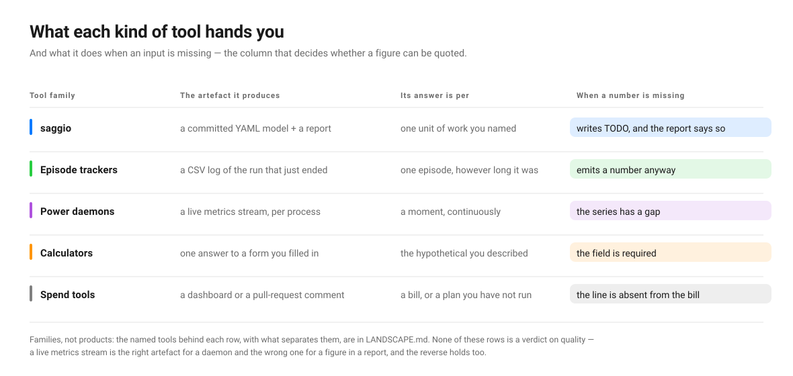

# Gallery

[🇫🇷 GALERIE.md](GALERIE.md) · 🇬🇧 English

Cost models this tool produced, on repositories you can go and read. Every file
under [`examples/`](examples/) was generated by the command printed above it, and
every one of them is committed with the report rendered beside it.

**None of these is a cost claim.** They are what `saggio audit` writes before a
human has touched anything: a model whose expensive numbers are still open, whose
unit of work is a proposal, and whose machine is the one that ran the audit rather
than the one the code runs on. That last point matters most here, because these
repositories were cloned and read on a laptop. Each model says so, in
`deployment.machine_provenance`. The value of the gallery is not the numbers. It
is seeing what the tool establishes, what it refuses to establish, and where it
gets things wrong.

Regenerate any of them:

```bash
saggio audit https://github.com/karpathy/nanoGPT --country FR --no-llm -o examples/nanoGPT.yaml
saggio render examples/nanoGPT.yaml -f md -o examples/nanoGPT.md
```

## The eight repositories

| Model | Repository | What it was read as | The interesting part |
|---|---|---|---|
| [`nanoGPT`](examples/nanoGPT.yaml) · [report](examples/nanoGPT.md) | `karpathy/nanoGPT` | training | Two disagreements about how long a run is, both reported |
| [`whisper`](examples/whisper.yaml) · [report](examples/whisper.md) | `openai/whisper` | command-line tool | Nothing invented: no model, no service, no run length |
| [`dinov2`](examples/dinov2.yaml) · [report](examples/dinov2.md) | `facebookresearch/dinov2` | training | Seven files disagree about how long a run is |
| [`fastapi`](examples/fastapi.yaml) · [report](examples/fastapi.md) | `fastapi/fastapi` | command-line tool | Its test suite is told apart from its code |
| [`airflow`](examples/airflow.yaml) · [report](examples/airflow.md) | `apache/airflow` | service | Nine languages, eight paid services, thirty-six models |
| [`saggio`](examples/saggio.yaml) · [report](examples/saggio.md) | this repository | command-line tool | Everything it appears to call, it calls only in tests |

| [`detectron2`](examples/detectron2.yaml) · [report](examples/detectron2.md) | `facebookresearch/detectron2` | inference | The first example read as inference, and nothing invented to fill it |
| [`xberg`](examples/xberg.yaml) · [report](examples/xberg.md) | `xberg-io/xberg` | service | Fourteen languages, only 3.6% of it Python |
### nanoGPT — the size of a run is not one number

Read as a **training** workload importing PyTorch, transformers and NumPy. A full
run is `600000` iterations, from `train.py::max_iters`. Three other files in the
same repository say something else, and the model says so rather than settling it:

> `max_iters` is stated more than once and the statements disagree
> (`train.py` says 600000; `config/finetune_shakespeare.py` says 20;
> `config/train_gpt2.py` says 600000; `config/train_shakespeare_char.py` says
> 5000). `train.py::max_iters` was used; check it is the one a real run reads.

That sentence is the product. A tool that quietly picked one would be off by a
factor of thirty thousand on the character-level config, and nobody would know.

### whisper — read correctly, and nothing added

Read as a **command-line tool** importing PyTorch, NumPy and ffmpeg, which is what
Whisper is. No paid service, no model identifier, no run length: Whisper's code
states none of them, so the model states none of them either.

That empty answer took a fix to get. An earlier version of this page reported a
model called `Whisper`, from `whisper/decoding.py:20`:

```python
model: "Whisper", mel: Tensor, tokenizer: Tokenizer = None
```

That is a type annotation in a function signature. Python has no unquoted mapping
keys, so a colon after a bare name is an annotation and never a model being
chosen; the detector now knows the difference, and the line above finds nothing.

### dinov2 — the tool picked one, and says to check it

Read as **training**, and as compute-bound, which licenses the accelerator
projection. Seven files state an epoch count and they disagree: the training
configs say 400 and 500, the SSL default says 100, the evaluation scripts say 10
and 30. It goes with `configs/train/cell_dino/vitl16_boc_hpafov.yaml`, and lists
the other six.

It used to go with `configs/eval/...`, an *evaluation* config, because the rule was
alphabetical and `eval` sorts before `train`. A repository that separates
`configs/train` from `configs/eval` is telling you which of the two a real run
reads, and the rule now listens: a training directory outranks a neutral one,
which outranks an evaluation, benchmark or example one.

Among four training configs it is still alphabetical, and 400 against 500 is a
real ambiguity this cannot settle. What it does instead is name the file it used
and the six it did not, so the question takes one glance to find.

### fastapi — the suite is not the workload

Read as a **command-line tool**, 1138 Python files, no compute framework. It finds
three model identifiers, and all three arrive carrying a caveat:

```yaml
- model: alexnet
  detected_at: tests/test_tutorial/test_path_params/test_tutorial005.py:12
  caveat: Found only in the code that tests this repository, so it may not be part
    of the workload. Confirm before pricing it.
```

`alexnet`, `lenet` and `resnet` are strings in a tutorial test. They are reported,
because dropping them silently would be its own kind of dishonesty, and they are
flagged, because FastAPI does not call them.

There used to be a fourth, `Body_`, from `model_name = "Body_" + name` in FastAPI's
own internals. A string literal with a `+` against it is a fragment being built,
not a model being named, and the detector now says so.

### airflow — the stress test

Nine languages. 7920 Python files, 1112 TypeScript, and Go, Kotlin, Java, Shell,
JavaScript and Scala behind them. Eight paid services detected with the line that
proves each one, from `providers/anthropic/.../operators/agent.py:36` to
`providers/sendgrid/.../emailer.py:28`. Thirty-five model identifiers, from
`claude-opus-4-8` to `bedrock:us.anthropic.claude-opus-4-5`, each with the line
that names it.

No size of a run: nothing in Airflow states one, so `total_work` is absent rather
than guessed. That is the right answer for an orchestrator, which has no run
length of its own.

### saggio — auditing itself

Everything this package appears to call, it calls only in its own tests: one
service and three model identifiers, all four carrying the caveat. Its single
framework, `ffmpeg`, comes from the quoted key `"ffmpeg"` in its own detector
table. A repository containing detection tables detects itself, which is inherent
and is said rather than hidden.

Its run length, `num_samples: 5000`, comes from
`examples/walkthrough/counter/config.py` — the toy repository further down this
page. Nothing else in this package states how much work a run performs, so the
only statement wins. It is the right answer to the question as asked and the wrong
answer to the question meant, and the model names the file so the difference is
one line away.

### detectron2 — the first one read as inference

Read as **inference**, which no earlier example was. The six before it covered
training twice, a service once and a command-line tool three times, so the
archetype that matters most to anyone pricing a request had never been
exercised. 497 Python files alongside C, C++ and Shell; PyTorch and NumPy found,
and nothing else claimed.

What is worth looking at is how much of this model is open. No entry point was
found, so there is no run to time; no model identifier and no paid service are
named, so there is nothing to price; the work size is unstated, so the run
length stays `TODO`. A tool keen to look useful would have filled those from the
model zoo in the documentation. This one reports an empty hand, which is the
honest reading of a detection *framework*: what it costs depends entirely on
which model you point it at, and the repository does not choose for you.

### xberg — fourteen languages, and Python is 3.6% of it

Every other example in this gallery is a Python repository. This one is
[xberg](https://github.com/xberg-io/xberg) — formerly Kreuzberg, which is what
the redirect still says — a document-intelligence engine whose core is Rust with
bindings for fifteen languages. The reader finds 2,278 Rust files, 435 Java, 400
C#, 391 Kotlin and 143 Python, and reports it as mixed rather than reducing it
to whichever language has most files. That is the claim
[`LANDSCAPE.md`](LANDSCAPE.md) makes about breadth, demonstrated on a repository
that could have embarrassed it.

**It also broke two things, both since fixed.** The suite-detection rule was
Python- and JavaScript-shaped: `tests/`, `test_*.py`, `*.test.ts`. Rust puts its
tests in a *file* called `tests.rs`, so ten model identifiers named `test-model`
and `mock-model` arrived with no caveat at all. The rule now recognises a suite
in whatever language it is written, and refuses `latest.rs` and `contest.py`,
which a looser first attempt swept up.

**And one that is not fixed, and is named here rather than hidden.** Rust keeps
unit tests *inside* the file they test, in a `#[cfg(test)] mod tests` block.
File-level detection cannot see that, so fixtures like `trusted/model` and
`gpt-test` still appear beside the genuine `openai/gpt-4o` and
`anthropic/claude-sonnet-4-20250514` that this engine really does call. Reading
inside a file for an inline test module is a different and larger job than
reading its name.

## The walkthrough: one workload, four stages

[`examples/walkthrough/`](examples/walkthrough/) takes one tiny repository from
nothing to a committed model, in the order a maintainer actually does it.

| Stage | File | What changed |
|---|---|---|
| 1 | [`1-as-read.yaml`](examples/walkthrough/1-as-read.yaml) | The audit, without running anything. Every cost is `TODO`. |
| 2 | [`2-measured.json`](examples/walkthrough/2-measured.json) | A real `saggio measure` run over a 500-sample slice. |
| 3 | [`3-measured.yaml`](examples/walkthrough/3-measured.yaml) | The measurement folded in, and a whole run projected from it. |
| 4 | [`4-diff.txt`](examples/walkthrough/4-diff.txt) | What `saggio diff` reports between the first and the third. |
| 5 | [`5-run.yaml`](examples/walkthrough/5-run.yaml) | `saggio audit --run --scaling-steps 3`: reading, measuring and fitting in one command. |

```bash
saggio audit examples/walkthrough/counter --country FR --no-llm -o examples/walkthrough/1-as-read.yaml
saggio measure --no-profile --json --into ../3-measured.yaml --units 500 -- python predict.py --num_samples 500
saggio diff examples/walkthrough/1-as-read.yaml examples/walkthrough/3-measured.yaml
```

Stages two and three come out of the same command. `--into` writes the measured
runtime into the model and recomputes everything that derives from it, which is
the part nobody gets right by hand: pasting a runtime into a YAML file leaves the
energy, the money and the carbon holding their old values, and a model whose
energy no longer matches its runtime is worse than one that had neither, because
it looks finished. `--units 500` says the command performed five hundred units of
work, so the recorded figure is per unit. `saggio audit --run` does the reading
and the running in one step instead, and asks for consent first, because that path
executes the repository's own code.

The lesson is in the diff, and the first line of it is the one to read twice:

```
assumptions.power_draw: 83.76 -> 31.1047 (-62.9%), estimated -> measured
assumptions.machine_energy: no number -> 1.141e-08, TODO -> measured
scenarios[0].runtime: no number -> 0.00132057, TODO -> measured
scenarios[0].costs.energy: no number -> 2.03e-08, TODO -> estimated
```

**A datasheet said 83.76 W. The counter said 31.10 W.** The nameplate was wrong
by a factor of two and a half for this workload, which is the whole argument for
reading a counter rather than a specification — and the figure only moved because
the machine would answer, which it does on Linux and on Apple Silicon.

Then the rule computes itself, in four steps anybody can follow. The runtime is
`measured`, because a stopwatch was held around it. The power is `measured`,
because a counter was read. The **machine** energy is therefore `measured` too,
with no decision taken by anybody: both of its inputs are. And the **facility**
energy is `estimated`, because it is the machine energy multiplied by a datacenter
overhead that nobody here measured. The weakest-link rule is not a policy applied
afterwards; it is what the arithmetic produces.

Stage five does the same thing in one command, and is the more interesting file
of the two because of what it refuses:

```bash
saggio audit examples/walkthrough/counter --country FR --no-llm --run --scaling-steps 3 \
  -o examples/walkthrough/5-run.yaml
```

> The work grew more slowly than the size, by a power of 0.69. Over these sizes
> the run is dominated by costs that do not grow with the job — start-up,
> imports, loading a model — so the slices are mostly measuring overhead and a
> projection from them would overstate the whole run.

That exponent is `measured`, over the three sizes that were run, with an R² of
0.999. It is also *bad news about the measurement*, which is the point: a slice
this small is mostly Python starting up, and the tool says so rather than
projecting from it with a straight face.

## The same work, through the other tools

The gallery above is one tool's output on six repositories. It is worth knowing
what the alternatives would have handed you for the same work, because for a lot
of jobs one of them is the better answer — and because the thing that separates
them is not accuracy but **what they produce and what they do when they cannot
answer.**

<p align="center">
  
</p>

Read the last column first. It is the one that decides whether a figure survives
being quoted.

The figure groups by family. These are the tools in each, and each one's own
page is the place to judge it rather than this one:

| Family | The tools it stands for |
|---|---|
| Episode trackers | [CodeCarbon](https://codecarbon.io/), [eco2AI](https://github.com/sb-ai-lab/Eco2AI), [carbontracker](https://github.com/lfwa/carbontracker) |
| Power daemons | [Scaphandre](https://github.com/hubblo-org/scaphandre), [PowerAPI](https://powerapi.org/), [Kepler](https://sustainable-computing.io/) |
| Calculators | [Green Algorithms](https://www.green-algorithms.org/) |
| Spend tools | [Infracost](https://www.infracost.io/), [Cloud Carbon Footprint](https://www.cloudcarbonfootprint.org/), [OpenCost](https://www.opencost.io/) |

**None of those last-column behaviours is a flaw.** A daemon that stopped the
world to ask you a question would be a bad daemon; a gap in a time series is the
honest shape of a missing sample. A calculator with a required field is doing
exactly its job. The column is not a scoreboard — it is the reason these tools
are not interchangeable, and the reason a figure from one of them cannot simply
be pasted where a figure from another is expected.

What the comparison cannot show, and should not pretend to: **the numbers do not
line up.** A CodeCarbon figure for a training run and a saggio figure for one
inference are not two measurements of one thing, any more than the gallery's own
six models compare with each other — each is per its own unit of work, which is
the first thing every report here says. Nothing on this page ranks the tools by
their output, because their outputs are not on one scale.

Where each tool is genuinely better, where this one is weakest, and the
twelve-row rating table the positioning map is drawn from, are all in
[`LANDSCAPE.md`](LANDSCAPE.md) — including the cases where the honest advice is
to use something else.

## What these files caught, and what is still wrong

A gallery that only showed the tool at its best would be an advertisement. This
one was built, read, and then used as a bug report against the package that
produced it.

**Three defects it found, since fixed.** A `model:` in a Python type annotation
was read as a model being called, which is where Whisper's phantom model came
from. A string literal with a `+` against it was read the same way, which is where
FastAPI's `Body_` came from. And the rule deciding which file states the length of
a run was alphabetical, so `configs/eval` beat `configs/train` and DINOv2's epoch
count came out of an evaluation config. The files above are regenerated, and none
of the three shows any more.

**One it found that is not shipped here.** vLLM was audited too and is not in the
table: its model is 162 KB, and 95% of that is a list of 333 model identifiers
nobody will read. The finding is worth more than the file. 127 of those hits came
from `examples/` and `benchmarks/`, which are part of a repository and are not
part of what it does for a living — the same reasoning that already refused to
take a training run's length from an evaluation config, which had simply never
been applied to what the code *calls*. Those hits now carry a caveat saying so,
and the signal went from 152 uncaveated identifiers to 17. Audit it yourself with
the command at the end of this page if you want to see it.

**One more it found, and closed by adding a command.** The third stage of the
walkthrough had to be written by a script calling the Python API, because nothing
on the command line could put a measurement into an existing model: pasting a
runtime into YAML leaves everything derived from it stale. `saggio measure --into`
now does it, and the script is gone.

**What is still wrong, in these files, today.**

- **A Rust inline test module is invisible.** Rust keeps unit tests inside the
  file they test, in a `#[cfg(test)] mod tests` block, so `xberg` reports
  fixtures like `trusted/model` and `gpt-test` beside the models it really
  calls. File-level detection cannot see inside a file.

- **This package's own run length comes from a toy.** `saggio.yaml` reports
  `num_samples: 5000` from `examples/walkthrough/counter/config.py`, which is the
  fixture on this page. Nothing else here states one, so the only statement wins.
- **A repository that contains detection tables detects itself.** `saggio.yaml`
  reports `ffmpeg` as a framework because the string `"ffmpeg"` is a key in its own
  table. Inherent, and said rather than hidden.
- **Four training configs, and the choice among them is alphabetical.** DINOv2 is
  now read from `configs/train`, which is the right category, and 400 against 500
  within it is a real ambiguity nothing here can settle. It is reported, not
  decided.
- **The deployment block describes a laptop.** Each of these repositories was
  cloned and read on one machine, and `power_draw` is that machine's. The models
  say so in `deployment.machine_provenance`, and every energy figure under it means
  nothing until somebody states where the code actually runs.
- **Every catalogue number here is a seed.** The wattages, the tariff and the grid
  intensity carry a `source_url` and a `retrieved_date`, and they have not each
  been verified against the page they name.

## Regenerating the whole gallery

```bash
saggio audit https://github.com/karpathy/nanoGPT --country FR --no-llm -o examples/nanoGPT.yaml
saggio audit https://github.com/openai/whisper --country FR --no-llm -o examples/whisper.yaml
saggio audit https://github.com/facebookresearch/dinov2 --country FR --no-llm -o examples/dinov2.yaml
saggio audit https://github.com/fastapi/fastapi --country FR --no-llm -o examples/fastapi.yaml
saggio audit https://github.com/apache/airflow --country FR --no-llm -o examples/airflow.yaml
saggio audit . --country FR --no-llm -o examples/saggio.yaml
```

Then render each one beside its model:

```bash
saggio render examples/airflow.yaml -f md -o examples/airflow.md
```

The numbers will not come back identical. These repositories change, and the
catalogue they are read against changes too. That is the point of committing a
model next to the code it describes: when it moves, `diff` says so.
