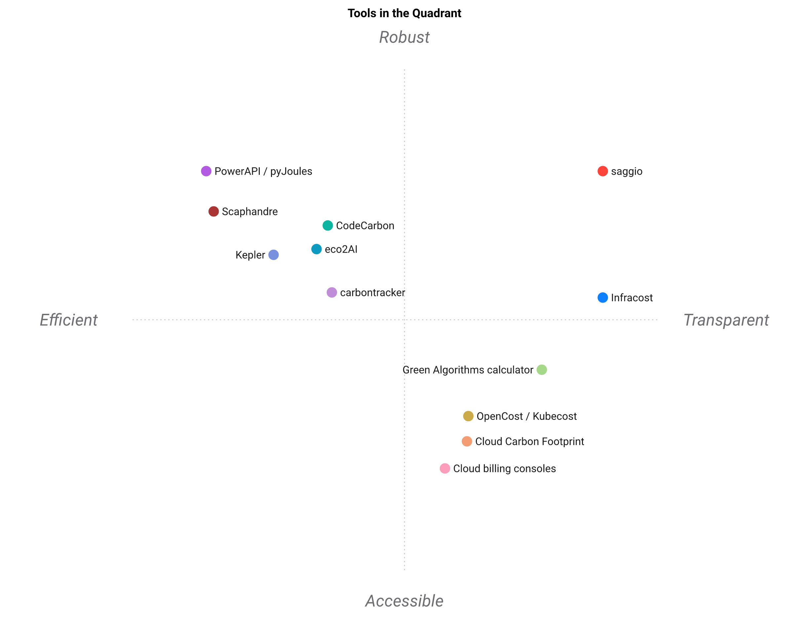

# Paysage

🇫🇷 Français · [🇬🇧 LANDSCAPE.md](LANDSCAPE.md)

Les autres outils du domaine « combien coûte l'exécution de ce code », et les cas
où chacun est le meilleur choix. Les notes vont de ⭐ (1) à ⭐⭐⭐⭐⭐ (5), attribuées
au regard du travail de *cet* outil-ci : **un modèle de coût versionné, relisible,
par unité de travail, sur plusieurs dimensions, où chaque chiffre dit jusqu'où on
peut lui faire confiance**. Un outil conçu pour un autre travail n'est pas pénalisé
d'être bon à ce travail-là ; la note ne dit que l'adéquation à cette niche.

Chiffres vérifiés le 2026-10-01. Les projets bougent ; si quelque chose ici a
vieilli, [dites-le](CONTRIBUTING.md).

## Vue d'ensemble

| | Modèle par unité | Provenance sur chaque chiffre | Multi-dimension | Artefact versionné | Mesure la puissance | Estime sans exécuter | Barrière de dérive | Rapports lisibles | Hors ligne |
| --- | :---: | :---: | :---: | :---: | :---: | :---: | :---: | :---: | :---: |
| **saggio** | ⭐⭐⭐⭐⭐ | ⭐⭐⭐⭐⭐ | ⭐⭐⭐⭐⭐ | ⭐⭐⭐⭐⭐ | ⭐⭐⭐⭐ | ⭐⭐⭐⭐ | ⭐⭐⭐⭐⭐ | ⭐⭐⭐⭐⭐ | ⭐⭐⭐⭐⭐ |
| CodeCarbon | ⭐⭐ | ⭐⭐ | ⭐⭐ | ⭐⭐ | ⭐⭐⭐⭐ | ⭐ | ⭐ | ⭐⭐⭐ | ⭐⭐⭐ |
| Calculateur Green Algorithms | ⭐⭐⭐ | ⭐⭐⭐⭐ | ⭐⭐⭐ | ⭐ | ⭐ | ⭐⭐⭐⭐⭐ | ⭐ | ⭐⭐⭐ | ⭐ |
| Scaphandre | ⭐ | ⭐⭐ | ⭐ | ⭐ | ⭐⭐⭐⭐⭐ | ⭐ | ⭐ | ⭐⭐ | ⭐⭐⭐⭐⭐ |
| PowerAPI / pyJoules | ⭐⭐ | ⭐⭐ | ⭐ | ⭐ | ⭐⭐⭐⭐⭐ | ⭐ | ⭐ | ⭐ | ⭐⭐⭐⭐⭐ |
| Kepler | ⭐ | ⭐⭐ | ⭐⭐ | ⭐ | ⭐⭐⭐⭐ | ⭐⭐ | ⭐ | ⭐⭐ | ⭐⭐⭐⭐ |
| eco2AI | ⭐⭐ | ⭐⭐ | ⭐⭐ | ⭐⭐ | ⭐⭐⭐ | ⭐ | ⭐ | ⭐⭐ | ⭐⭐⭐ |
| carbontracker | ⭐⭐ | ⭐⭐ | ⭐⭐ | ⭐ | ⭐⭐⭐⭐ | ⭐⭐⭐ | ⭐ | ⭐⭐ | ⭐⭐ |
| Cloud Carbon Footprint | ⭐ | ⭐⭐⭐ | ⭐⭐⭐ | ⭐ | ⭐ | ⭐⭐⭐ | ⭐ | ⭐⭐⭐⭐ | ⭐ |
| Infracost | ⭐⭐⭐ | ⭐⭐⭐ | ⭐ | ⭐⭐⭐ | ⭐ | ⭐⭐⭐⭐⭐ | ⭐⭐⭐⭐⭐ | ⭐⭐⭐⭐ | ⭐ |
| OpenCost / Kubecost | ⭐⭐ | ⭐⭐⭐ | ⭐⭐ | ⭐ | ⭐ | ⭐⭐ | ⭐⭐ | ⭐⭐⭐⭐ | ⭐ |
| Consoles de facturation cloud | ⭐ | ⭐⭐⭐⭐ | ⭐ | ⭐ | ⭐ | ⭐ | ⭐⭐ | ⭐⭐⭐⭐ | ⭐ |

## La carte

Le même tableau, dessiné. [standpoint](https://github.com/warith-harchaoui/standpoint)
passe une analyse en composantes principales sur les neuf notes et dispose chaque
outil le long des deux directions qui les distinguent vraiment, en orientant la
carte pour que saggio soit en haut à droite. Deux axes gardent environ 80 % de ce
qui sépare ces outils : 55 % horizontalement, 25 % verticalement. Les noms d'axes
sont la lecture que la machine fait des loadings ; ce que les loadings disent est
plus simple : plus on va à **droite**, plus l'outil produit des réponses sourcées,
versionnées, par unité de travail ; plus on va à **gauche**, plus il mesure la
puissance en direct. Plus on **monte**, plus il tourne sur votre propre machine et
la lit ; plus on **descend**, plus c'est quelque chose qu'on pointe vers une
facture ou un formulaire.

  

Les distances sont celles du tableau, pas une opinion : deux outils sont voisins
parce que leurs lignes de notes le sont. Après une mise à jour du tableau,
régénérez avec `standpoint <table> -r saggio --model qwen3:8b` et commitez les
`assets/landscape.png` et `assets/landscape.svg` rafraîchis.

## Les projets

### [CodeCarbon](https://codecarbon.io/)

L'outil le plus connu du domaine, et le bon premier choix quand ce qu'on veut,
c'est une ligne de Python qui enregistre les émissions d'un entraînement pendant
qu'il tourne. Il suit CPU, GPU et mémoire via RAPL et `nvidia-smi`, cherche une
intensité carbone régionale, et écrit un CSV.

Ce qui diffère : CodeCarbon mesure un *épisode*. Il répond « qu'a émis cette
exécution », pas « que coûte une requête », et sa sortie est un journal plutôt
qu'un artefact relu. Son échantillonnage est grossier par conception, et cela a un
prix mesuré : une étude 2026 d'outils fondés sur RAPL sondant à 1 kHz situe le
surcoût en temps de CodeCarbon entre 5,4 % et 46,8 % — ce qui plaide pour son
intervalle par défaut, pas contre l'outil. Il produit un chiffre que les entrées le justifient ou non,
ce qui est le bon choix pour de la télémétrie et le mauvais pour un chiffre que
quelqu'un citera dans un rapport. **Prenez CodeCarbon pour mesurer passivement des
entraînements. Prenez celui-ci pour un chiffre par unité que vous êtes prêt à
défendre.**

### [Green Algorithms](https://www.green-algorithms.org/)

Le calculateur derrière la méthode qu'implémente ce paquet, issu de
l'[article de 2021](https://doi.org/10.1002/advs.202100707). Excellent pour une
estimation ponctuelle d'un calcul déjà fait ou pas encore fait, sans aucune
instrumentation. Bien sourcé et clairement expliqué.

Ce qui diffère : c'est un formulaire web, donc sa réponse vit dans un onglet de
navigateur plutôt que dans votre dépôt, et il ne mesure pas, ne compare pas les
versions, ne lit pas votre code. **Prenez le calculateur pour une estimation
rapide. Prenez celui-ci quand l'estimation doit vivre à côté du code et être
revérifiée au trimestre prochain.**

### [Scaphandre](https://github.com/hubblo-org/scaphandre) et [PowerAPI](https://powerapi.org/) / [pyJoules](https://github.com/powerapi-ng/pyJoules)

De la vraie mesure de puissance. Scaphandre est un agent qui expose la puissance
par processus à Prometheus ; PowerAPI et pyJoules donnent des lectures RAPL fines
depuis Python. Tous deux mesurent bien mieux que ce paquet, qui lit le compteur du
paquet processeur autour d'une tranche bornée et rien de plus.

Ce qui diffère : ils produisent des watts, pas des coûts. Pas d'intensité carbone,
pas de tarif, pas d'unité de travail, pas de provenance, pas de rapport.
**Prenez Scaphandre ou PowerAPI quand il vous faut une mesure de puissance
continue et sérieuse. Injectez le résultat dans un modèle comme celui-ci quand il
doit vouloir dire quelque chose pour un lecteur.**

### [Kepler](https://sustainable-computing.io/)

Attribution de puissance et de carbone pour des charges Kubernetes, depuis les
compteurs matériels, exportée vers Prometheus. Fort sur son terrain. En 2026 il a
réécrit sa collecte pour lire `/proc` et `/sys` au lieu d'eBPF, abandonnant les
`CAP_BPF` et `CAP_SYSADMIN` dont il avait besoin — la même direction de moindre
privilège que prend ce paquet quand il imprime le remède pour un compteur réservé
à root au lieu d'acquérir les droits de le lire.

Ce qui diffère : c'est de l'infrastructure de cluster. Il répond « quels pods
consomment en ce moment », pas « que coûte une unité de travail », et il lui faut
un cluster pour répondre à quoi que ce soit. **Prenez Kepler pour une flotte en
production. Prenez celui-ci pour une base de code.**

### [eco2AI](https://github.com/sb-ai-lab/Eco2AI) et [carbontracker](https://github.com/lfwa/carbontracker)

Deux traceurs à décorateur pour l'entraînement de modèles, proches d'esprit de
CodeCarbon. `carbontracker` prédit en plus l'empreinte d'une exécution complète à
partir de ses premières époques, ce qui est exactement l'idée de la projection sur
l'exécution complète de ce paquet.

Ce qui diffère : comme CodeCarbon. En forme d'épisode, en forme de journal, et
muets sur la solidité de tel ou tel chiffre. **Prenez-les pour de la télémétrie
d'entraînement.**

### [Cloud Carbon Footprint](https://www.cloudcarbonfootprint.org/)

Lit vos données de facturation cloud et en estime les émissions, avec un bon
tableau de bord et une méthodologie publiée et défendable.

Ce qui diffère : il part de la facture, donc il ne peut décrire que ce que vous
avez déjà dépensé, à la granularité du compte. Il ne peut pas dire ce que coûte une
inférence, ni quoi que ce soit avant que vous ayez exécuté la chose. **Prenez-le
pour du reporting organisationnel sur la dépense cloud. Prenez celui-ci pour des
décisions d'ingénierie sur une base de code.**

### [Infracost](https://www.infracost.io/)

Ce qui ressemble le plus à ce projet en esprit, dans un autre domaine. Il lit du
Terraform, estime ce que coûtera l'infrastructure avant qu'elle soit appliquée, et
commente la différence sur votre pull request. La barrière de dérive ici est la
même idée.

Ce qui diffère : Infracost chiffre une infrastructure déclarée, pas du code
exécuté. Il ne parle que d'argent, et il répond « combien coûtera cette pile par
mois », pas « que coûte une unité de travail sur cinq dimensions ». **Prenez
Infracost pour l'infrastructure as code. Les deux répondent à deux moitiés de la
même question et cohabitent très bien.**

### [OpenCost](https://www.opencost.io/) et Kubecost

Allocation de coûts en temps réel pour Kubernetes, par namespace, charge et label.
La réponse standard à « quelle équipe dépense quoi » sur un cluster.

Ce qui diffère : de l'allocation d'une facture déjà engagée, pas un modèle d'unité
de travail. L'argent d'abord, le carbone en supplément. **Prenez OpenCost pour de
la refacturation interne.**

### Consoles de facturation cloud

AWS Cost Explorer, GCP Billing, Azure Cost Management. Font autorité sur ce qui
vous a été facturé, ce qui est exactement une dimension d'une question, après coup.
**Prenez-les quand la question est « pourquoi la facture était-elle si grosse ».**

## Là où celui-ci est le plus faible

Autant être honnête sur les manques, puisque c'est toute la prémisse de l'outil.

- **Rien n'est attribué à un processus.** Chaque compteur ici mesure la *machine*,
  et une ligne de base prise avant la tranche est la seule chose qui sépare
  l'exécution du navigateur à côté. Scaphandre, PowerAPI et Kepler modélisent la
  consommation par processus et par conteneur ; ce paquet ne le fait pas, et le dit
  dans le périmètre que porte chaque lecture. C'est le manque qui compte le plus
  sur une machine partagée.
- **Deux plateformes, pas trois.** Linux et macOS, qui lisent toutes deux de
  vrais compteurs — zones powercap par leur nom, `IOReport` sur Apple Silicon,
  NVML et les interfaces sysfs `amdgpu` / `i915` / `xe` pour l'accélérateur.
  Windows est hors périmètre plutôt qu'inachevé : il n'offre aucun compteur
  d'énergie processeur sans privilèges, aucun total de temps processeur machine,
  et aucune comptabilité POSIX des ressources — chaque chiffre y serait une
  estimation. Plus étroit que les outils au-dessus dans ce tableau, et étroit à
  dessein.
- **Un compteur n'est pas la prise murale.** Ventilateurs, stockage, réseau et
  alimentation sont hors RAPL et hors NVML par construction, et l'écart n'est pas
  une constante qu'on pourrait rajouter : mesuré face à des wattmètres physiques,
  c'est une pente d'environ 1,17, variable d'un nœud à l'autre. Chaque chiffre ici
  est le périmètre qu'il nomme, jamais la machine.
- **Pas de suivi continu.** Une tranche bornée, une fois. Si vous voulez une série
  temporelle, ce n'est pas la bonne forme d'outil.
- **Le carbone incorporé est implémenté et à peine catalogué.** L'arithmétique est
  là — les quatre termes d'ISO/IEC 21031, amortis en temps calendaire — et sept
  empreintes aussi : trois accélérateurs sur 25 lignes et quatre processeurs sur
  12. Tout le reste rapporte `TODO`. La durée de vie reste à vous, parce que
  combien de temps une carte reste en service est un fait sur un parc et non sur
  une pièce. Voir [`NORMES.md`](NORMES.md) pour le tableau et les huit refus.
- **Les catalogues sont petits.** Ils couvrent les accélérateurs courants et les
  grands réseaux électriques. Au-delà, vous tomberez sur un manque, et l'outil vous
  dira quelle ligne ajouter.
- **La projection entre machines est un rapport de fiches techniques.** Le débit
  crête n'est pas un benchmark. Les gains réels sont plus petits, et la projection
  le dit dans ses limites plutôt que dans une note de bas de page.

## Là où il vaut la peine d'être choisi

Quand le chiffre doit survivre à une contestation. Quand quelqu'un va mettre une
empreinte carbone par requête dans un document client, ou un coût par exécution
dans un budget, et qu'on lui demandera six mois plus tard d'où ça vient. C'est le
cas que ces outils, pour la plupart, ne servent pas : ils produisent des chiffres,
et celui-ci produit des chiffres qui viennent avec leur propre piste d'audit et
qui refusent d'exister quand il faudrait les inventer.

C'est aussi le seul outil de ce tableau qui *mesure comment le coût croît avec la
taille du travail* : trois tranches de tailles différentes, un exposant ajusté, une
qualité d'ajustement, et un refus net de projeter quand l'ajustement dit que les
tranches ne mesurent pas un comportement cohérent. Tous les autres ici projettent
au prorata des tailles, ou ne projettent pas.
